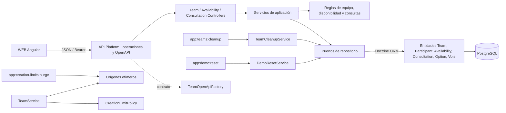
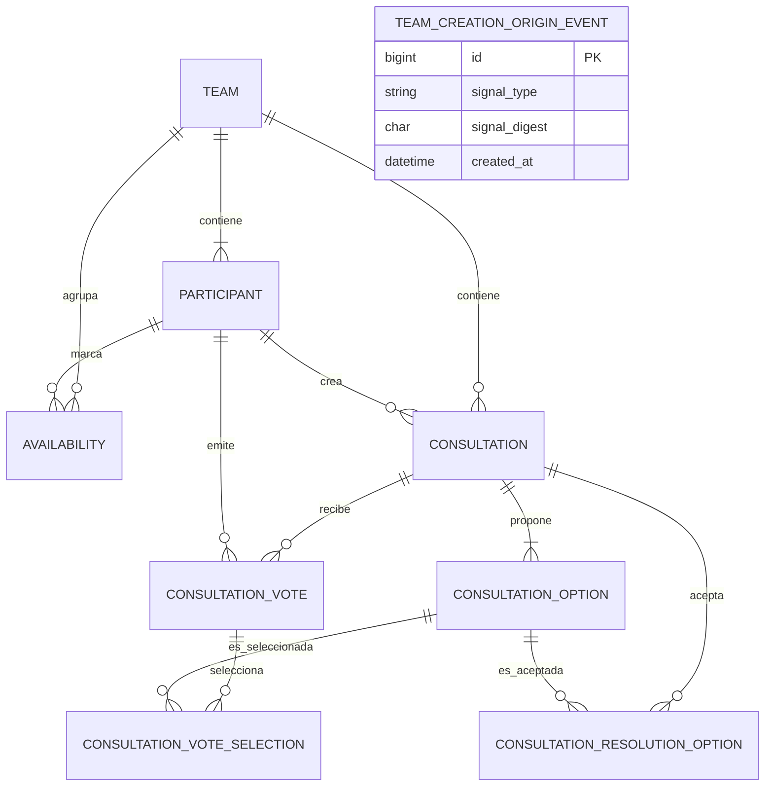

# Arquitectura del módulo API

La API usa PHP 8.5, Symfony 7.4, API Platform 5, Doctrine ORM y PostgreSQL 18. Permite crear equipos y publica operaciones protegidas para leerlos, incorporar participantes, gestionar disponibilidad y crear, votar, consultar y resolver consultas.

## Componentes y responsabilidades

- **Recursos y controladores:** `TeamOperations`, `AvailabilityOperations` y `ConsultationOperations` declaran las rutas. Sus controladores adaptan JSON, Bearer y respuestas HTTP; `TeamOpenApiFactory` publica el contrato y `ProblemDetailsSubscriber` gestiona errores inesperados.
- **Equipo:** `TeamService` crea y lee equipos, incorpora participantes y verifica el enlace. `ParticipantName`, `TeamTimeZone` y `ExpiryCalculator` contienen reglas comprobables del dominio.
- **Correo de creación por entorno:** `/api/configuration` publica si el campo de correo está habilitado. Con `TEAM_CREATION_EMAIL_ENABLED=false`, la API rechaza el correo entrante sin registrar eventos de notificación y el worker no envía mensajes; WEB oculta el campo. Si no puede consultar la configuración, WEB también lo mantiene oculto.
- **Límite de creación:** `CreationLimitPolicy` deriva el máximo y la ventana del entorno (`development`/`preproduction`: 2 equipos/60 minutos; `production`: 5/120) y permite sobrescribirlos independientemente con `TEAM_CREATION_LIMIT` y `TEAM_CREATION_WINDOW_MINUTES`. La creación cuenta señales de IP confiables y/o la clave aleatoria de dispositivo `X-Creation-Device`; si cualquiera supera el límite, responde `429`. En producción, la IP reenviada solo se acepta cuando Symfony identifica un proxy configurado como confiable; hasta verificar el proxy, se utiliza la señal first-party disponible. La transacción registra únicamente digests HMAC de las señales y su fecha, sin guardar IP/dispositivo ni asociarlos a un equipo. `app:creation-limits:purge` elimina eventos vencidos; la comprobación de creación también limpia los vencidos.
- **Disponibilidad:** `AvailabilityService` lee el intervalo y guarda marcas de participante; `DailyAvailability` valida estados, fechas editables y resumen diario.
- **Consultas:** `ConsultationService` lista, crea, muestra el detalle, registra o retira votos por opción y resuelve consultas de texto o fechas. `TextConsultationRules` y `DateConsultationRules` validan las opciones de creación. Las mutaciones comprueban acceso, identidad y vigencia bajo bloqueo del equipo; el repositorio aplica las restricciones de voto y resolución.
- **Envío opcional del enlace (ADR-EQU-002):** `TeamService` cifra dirección y token con `SodiumPayloadCipher` (clave `MAIL_EVENT_KEY`) y guarda equipo, participante y evento `team_mail_attempt` en una transacción; la respuesta añade `mailAttempt` con un recibo aleatorio del que solo se guarda el SHA-256. El comando `app:mail:process` (servicio `mail-worker`) ejecuta `MailAttemptProcessor`: reclama un evento con `FOR UPDATE SKIP LOCKED`, confirma `started` antes de llamar a `SymfonyTeamLinkMailer` (una sola llamada SMTP, sin reintentos), registra `succeeded` o `failed` y borra el contenido cifrado; los eventos pendientes o iniciados que superan `MAIL_EVENT_TTL_SECONDS` se cierran como `failed` sin llamar al proveedor. `EmailLayout` y `TeamLinkMessage` componen el HTML y el texto. `MailAttemptStatusService` solo devuelve el estado; `succeeded` significa aceptación por el transporte, no entrega al buzón.
- **Persistencia y limpieza:** los repositorios `Orm*Repository` implementan los puertos de aplicación con Doctrine. `TeamCleanupService`, `TeamDeletionPolicy` y el comando `app:teams:cleanup` eliminan de la base activa los equipos cuyo plazo de retención terminó. El comando requiere ejecución externa; no hay tarea programada en el repositorio.
- **Juego demo local:** `app:demo:reset` sustituye todos los equipos por el fixture demo mediante transacción, protegido para el perfil local. Solicita confirmación interactiva; `--force` sirve para ejecución no interactiva sin omitir las guardas de entorno. No hay reset programado en el repositorio.

## Operaciones actuales

| Recurso | Operaciones |
|---|---|
| Configuración pública | `GET /api/configuration`: devuelve `teamCreationEmailEnabled`, `teamCreationMaxTeams` y `teamCreationWindowMinutes`; respuesta `no-store` |
| Equipo | `POST /api/teams` (con `email` opcional y `X-Creation-Device` opcional), `GET /api/teams/current`, `POST /api/teams/current/participants`; la creación puede responder `429` si una señal supera el límite |
| Envío del enlace | `GET /api/mail-attempts/current`: estado `pending`, `succeeded` o `failed`, identificado por el recibo en la cabecera `X-Mail-Receipt` |
| Disponibilidad | `GET /api/teams/current/availability`, `PUT /api/teams/current/availability/{date}/participants/{participantId}` |
| Consultas | `GET /api/teams/current/consultations`, `POST /api/teams/current/consultations` para opciones de texto o fecha, `GET /api/teams/current/consultations/{consultationId}` |
| Votos y resolución | `PUT /api/teams/current/consultations/{consultationId}/votes/{participantId}/options/{optionId}`, `PUT /api/teams/current/consultations/{consultationId}/resolution` |

Las rutas del equipo vigente comprueban el Bearer del enlace. Las respuestas son JSON o Problem Details y se describen en `/api/docs`.

## Persistencia

Las migraciones en `apps/api/migrations/` crean diez tablas: equipo, participante, disponibilidad, consulta, opción, voto, selección de voto, opción aceptada en la resolución, evento de envío del enlace (`team_mail_attempt`, sin dirección ni token tras finalizar) y evento de origen para limitar la creación (`team_creation_origin_event`). Esta última tabla no tiene clave foránea a equipos y sólo guarda tipo de señal, digest HMAC y fecha de creación; la purga elimina señales fuera de la ventana configurada. Cada opción de consulta guarda texto **o** fecha civil, con una restricción que exige exactamente uno de esos valores. La consulta conserva el participante y la fecha de resolución. Las claves foráneas aplican borrado en cascada desde el equipo; la cascada para votos y resoluciones quedó verificada en [SPEC-EQU-002 — Borrado de equipos caducados](../../pdi_doc/08_especificaciones/99_archivadas/spec-equ-002-borrado-equipo-caducado.md).

## Operaciones locales

El reset manual se ejecuta con `php bin/console app:demo:reset` desde el servicio API de desarrollo. El comando requiere `APP_ENV=dev`, `SYNQO_DEPLOYMENT_ENV=development` y una base PostgreSQL local; en modo no interactivo requiere `--force`. En modo interactivo imprime los enlaces de acceso del fixture. El reset no modifica la tabla independiente de señales de creación ni configura una tarea programada. El README de API describe el procedimiento reproducible.

## Runtime de preproducción Railway

En REL-002, Symfony se ejecuta en FrankenPHP/Caddy junto a los assets de WEB, en la misma imagen y dominio público. Caddy pasa `/api` y `/api/...` al front controller PHP; las rutas API desconocidas deben conservar el error Symfony/API y no responder con el fallback Angular. El runtime normal de peticiones de FrankenPHP se usa sin worker mode. `PORT` controla el listener y `/healthz` es un healthcheck HTTP básico, no una prueba de conectividad PostgreSQL.

El servicio Railway referencia `DATABASE_URL` del PostgreSQL gestionado y ejecuta `doctrine:migrations:migrate --no-interaction` como paso pre-deploy de cada publicación manual. Antes de publicar, se revisan las migraciones pendientes y sus efectos; volver a una imagen anterior no revierte una migración ni restaura datos. El correo se configura apagado en preproducción (`TEAM_CREATION_EMAIL_ENABLED=false`, `MAILER_DSN=null://null`) hasta que exista un proveedor seguro. El procedimiento operativo está en el runbook de despliegue de REL-002.

Las rutas `/api/*` permanecen bajo Symfony/API Platform y no reciben el fallback SPA. Las rutas desconocidas devuelven Problem Details JSON con `404`; `/api` se reserva para el endpoint de documentación de API Platform.

## Desarrollo

El paquete Composer se identifica como `synqo/api` con metadato `proprietary` para las aportaciones propias. `apps/api/LICENSE` conserva el aviso MIT de Symfony Skeleton; no licencia toda Synqo. El staging de producción preserva el vendor íntegro y añade los avisos propios y agregados de terceros mediante el [procedimiento de distribución](../legal/procedencia-y-avisos.md).

Los comandos de Composer, migraciones, limpieza, base de prueba y análisis estático están en el [README principal](../../README.md#desarrollo-local). Los scripts ejecutables se declaran en `apps/api/composer.json`.
