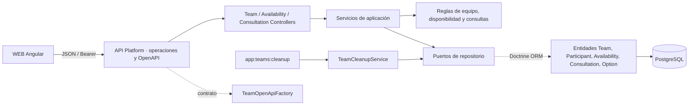
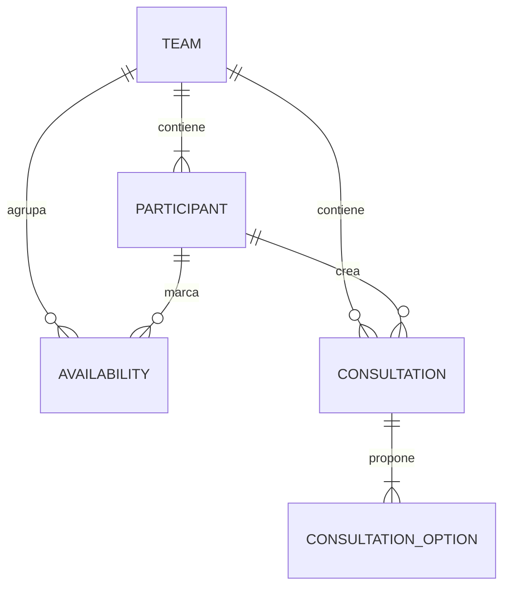

# Arquitectura del módulo API

La API usa PHP 8.5, Symfony 7.4, API Platform 5, Doctrine ORM y PostgreSQL 18. Permite crear equipos y publica operaciones protegidas para leerlos, incorporar participantes, gestionar disponibilidad y crear/listar consultas. El voto y la resolución aún no tienen operaciones.

## Componentes y responsabilidades

- **Recursos y controladores:** `TeamOperations`, `AvailabilityOperations` y `ConsultationOperations` declaran las rutas. Sus controladores adaptan JSON, Bearer y respuestas HTTP; `TeamOpenApiFactory` publica el contrato y `ProblemDetailsSubscriber` gestiona errores inesperados.
- **Equipo:** `TeamService` crea y lee equipos, incorpora participantes y verifica el enlace. `ParticipantName`, `TeamTimeZone` y `ExpiryCalculator` contienen reglas comprobables del dominio.
- **Disponibilidad:** `AvailabilityService` lee el intervalo y guarda marcas de participante; `DailyAvailability` valida estados, fechas editables y resumen diario.
- **Consultas:** `ConsultationService` lista y crea consultas abiertas de texto o fechas. `TextConsultationRules` y `DateConsultationRules` validan las opciones; la creación comprueba acceso, identidad y vigencia bajo bloqueo del equipo. La API aún no registra votos ni resuelve consultas.
- **Persistencia y limpieza:** los repositorios `Orm*Repository` implementan los puertos de aplicación con Doctrine. `TeamCleanupService`, `TeamDeletionPolicy` y el comando `app:teams:cleanup` eliminan de la base activa los equipos cuyo plazo de retención terminó. El comando requiere ejecución externa; no hay tarea programada en el repositorio.

## Operaciones actuales

| Recurso | Operaciones |
|---|---|
| Equipo | `POST /api/teams`, `GET /api/teams/current`, `POST /api/teams/current/participants` |
| Disponibilidad | `GET /api/teams/current/availability`, `PUT /api/teams/current/availability/{date}/participants/{participantId}` |
| Consultas | `GET /api/teams/current/consultations`, `POST /api/teams/current/consultations` para opciones de texto o fecha |

Las rutas del equipo vigente comprueban el Bearer del enlace. Las respuestas son JSON o Problem Details y se describen en `/api/docs`.

## Persistencia

Las migraciones en `apps/api/migrations/` crean las cinco tablas. Cada opción de consulta guarda texto **o** fecha civil, con una restricción que exige exactamente uno de esos valores. Las claves foráneas aplican borrado en cascada desde el equipo; las futuras tablas de votos y resoluciones deberán integrarse y verificarse antes de cerrar [SPEC-EQU-002 — Borrado de equipos caducados](../../pdi_doc/08_especificaciones/01_activas/spec-equ-002-borrado-equipo-caducado.md).

## Desarrollo

Los comandos de Composer, migraciones, limpieza, base de prueba y análisis estático están en el [README principal](../../README.md#desarrollo-local). Los scripts ejecutables se declaran en `apps/api/composer.json`.
