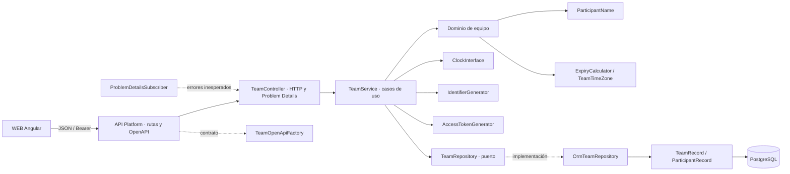
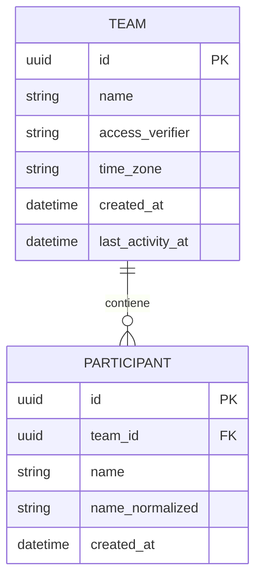

# Arquitectura del módulo API

La API usa PHP 8.5, Symfony 7.4, API Platform 5 y Doctrine ORM con PostgreSQL 18. Las operaciones existentes son creación de equipo, lectura protegida del equipo e incorporación de participante. El calendario y las consultas todavía no tienen operaciones.

## Componentes y responsabilidades

- **API Platform y `TeamOperations`:** publican exclusivamente `POST /api/teams`, `GET /api/teams/current` y `POST /api/teams/current/participants`; generan el documento OpenAPI.
- **TeamController:** adapta HTTP a los casos de uso: decodifica JSON, extrae Bearer y convierte errores conocidos en Problem Details con sus estados.
- **TeamService:** implementa creación y lectura del equipo, autorización por el verificador del enlace, alta de participantes, reloj y cálculo de caducidad. Recibe interfaces para persistencia e identificadores/secreto.
- **Dominio:** `ParticipantName` valida y normaliza nombres; `TeamTimeZone` aplica la zona por defecto; `ExpiryCalculator` calcula la fecha límite.
- **TeamRepository:** puerto de aplicación. `OrmTeamRepository` lo implementa con Doctrine ORM y transacciones; al incorporar un participante bloquea y refresca el equipo antes de revisar caducidad y guardar.
- **Entidades Doctrine:** `TeamRecord` y `ParticipantRecord` mapean las tablas `team` y `participant`. PostgreSQL impone la unicidad del nombre normalizado por equipo y elimina participantes al borrar su equipo.
- **OpenAPI y errores globales:** `TeamOpenApiFactory` describe entradas, salidas, autenticación y respuestas; `ProblemDetailsSubscriber` devuelve un error genérico ante excepciones HTTP no controladas.

## Estructura de datos actual

La aplicación conserva el SHA-256 del valor de acceso, no el secreto del enlace. La migración vigente está en `migrations/`; Doctrine ORM gestiona las operaciones de lectura y escritura.

## Desarrollo

Los comandos de Composer, migraciones, base de prueba, análisis estático y ejecución local están en el [README principal](../../README.md#desarrollo-local). Los comandos reales también están declarados en `apps/api/composer.json`.
