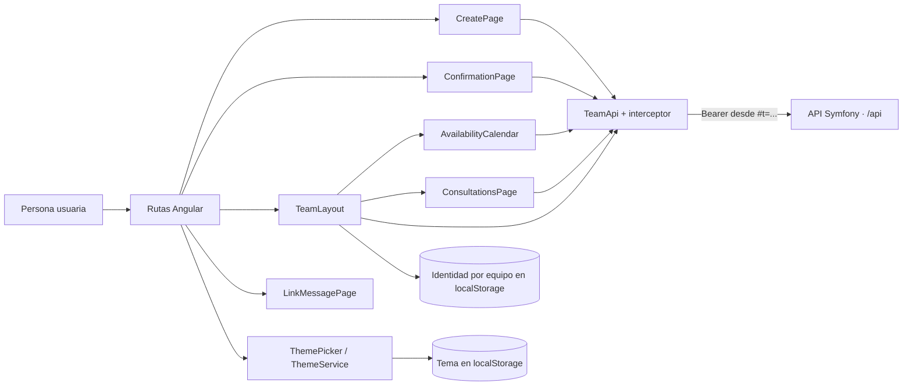
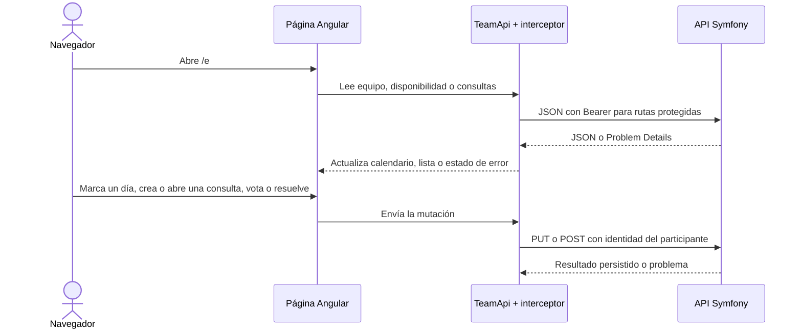

# Arquitectura del módulo WEB

WEB es una aplicación Angular 21 que se ejecuta en el navegador; Node.js 24 se usa para desarrollo y compilación. Conserva tema e identidad seleccionada en el navegador y consume la API por HTTP. No accede directamente a PostgreSQL.

## Componentes

- **App y rutas:** `app.ts`, `app.routes.ts` y `app.config.ts` configuran navegación, tema y el interceptor HTTP. Hay páginas de creación, confirmación, equipo y estados de enlace.
- **CreatePage y ConfirmationPage:** permiten crear el equipo y copiar o compartir su enlace. El correo opcional se envía a la API; el recibo devuelto se recuerda por equipo en `localStorage` (`synqo-mail-attempt-<id>`, separado del enlace) y el resultado reciente se conserva en memoria durante la navegación.
- **MailAttemptNotice y MailAttemptTracker:** consultan `GET /api/mail-attempts/current` con el recibo mientras esté pendiente. Un fallo muestra el aviso con el enlace en la confirmación y en el equipo hasta que se descarte; el descarte se guarda con el recibo.
- **TeamLayout:** carga el equipo y presenta cabecera, selector de identidad, enlace y pestañas. La identidad activa se recuerda por equipo en `localStorage`; el secreto de acceso permanece en el fragmento URL.
- **AvailabilityCalendar:** lee las marcas y los recuentos por día, permite marcar o cambiar la disponibilidad propia y consultar el detalle. Desde el calendario se crea una consulta de fechas seleccionando entre una y diez fechas; el panel de edición se adapta a escritorio y móvil.
- **ConsultationsPage:** lista consultas de texto y fecha por estado, permite crear consultas con opciones de texto y abre el detalle de una consulta.
- **ConsultationDetailPage:** muestra opciones, recuentos y votantes; permite cambiar el voto propio en consultas abiertas. Presenta el diálogo de resolución y la lectura de resultados o rechazo cuando la consulta se cierra. Si falla una mutación, restaura el estado confirmado y ofrece reintento.
- **TeamApi e interceptor:** agrupan las peticiones JSON de equipo, disponibilidad y consultas. El interceptor lee `t` del fragmento y lo envía como Bearer en las llamadas `/api/`.
- **ThemePicker, ThemeService y LinkMessagePage:** gestionan el tema automático, claro u oscuro, y los mensajes de equipo caducado o enlace no encontrado.

## Recorrido HTTP

## Desarrollo

Los comandos de instalación, servidor, pruebas, lint, formato y build están en el [README principal](../../README.md#desarrollo-local). Las rutas y los recorridos Playwright están en `apps/web/src/app/` y `apps/web/e2e/`.
