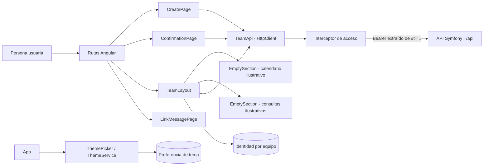
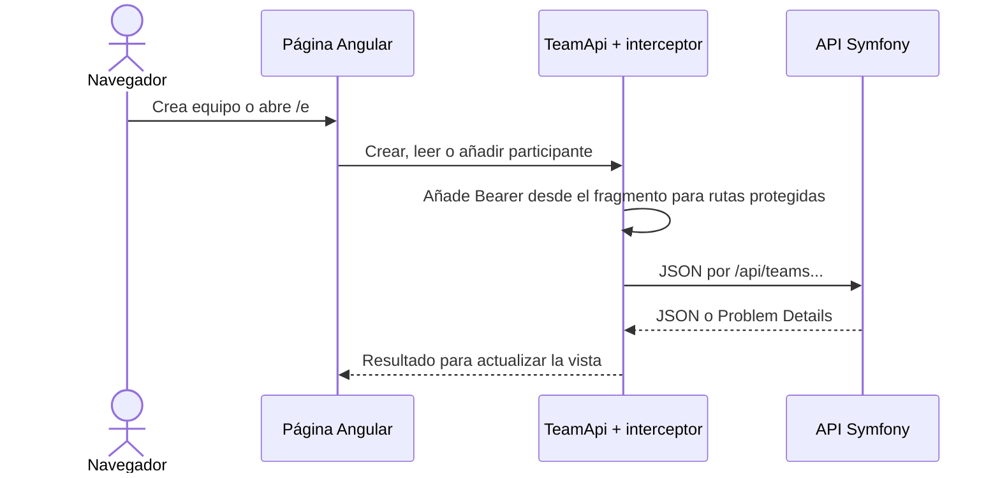

# Arquitectura del módulo WEB

WEB es una aplicación Angular 21 que se ejecuta en el navegador con Node.js 24 durante el desarrollo. Presenta los recorridos, conserva preferencias e identidad seleccionada en el navegador y consulta la API por HTTP. No accede a PostgreSQL.

## Componentes

- **App y rutas:** `app.ts`, `app.routes.ts` y `app.config.ts` montan el selector de tema, la navegación y el interceptor HTTP. Las rutas separan creación, confirmación, equipo y estados de enlace.
- **CreatePage:** recoge nombre del equipo y primer participante y envía la creación a la API. El campo de correo es ilustrativo y no se transmite.
- **ConfirmationPage:** muestra el equipo creado y permite copiar o compartir el enlace. Su estado reciente se mantiene en memoria del servicio durante la navegación.
- **TeamLayout:** carga el equipo, comprueba la identidad local elegida y presenta la cabecera, selector de identidad, enlace y navegación interior. La selección por UUID se recuerda en `localStorage`; el valor secreto del enlace permanece en el fragmento URL.
- **TeamApi e interceptor:** agrupan las peticiones JSON. El interceptor obtiene el secreto `t` del fragmento y lo envía como Bearer en las llamadas `/api/`.
- **ThemePicker y ThemeService:** aplican tema automático, claro u oscuro; la preferencia se guarda en `localStorage`.
- **EmptySection y LinkMessagePage:** renderizan las superficies actuales de calendario y consultas, y los estados de enlace caducado o no encontrado. Calendario y consultas aún son ilustrativos y no leen ni escriben disponibilidad o consultas.

## Recorrido HTTP

## Desarrollo

Los comandos de instalación, servidor, pruebas, lint, formato y build están en el [README principal](../../README.md#desarrollo-local). Las rutas reales y los tests de navegador están bajo `src/app/` y `e2e/`.
