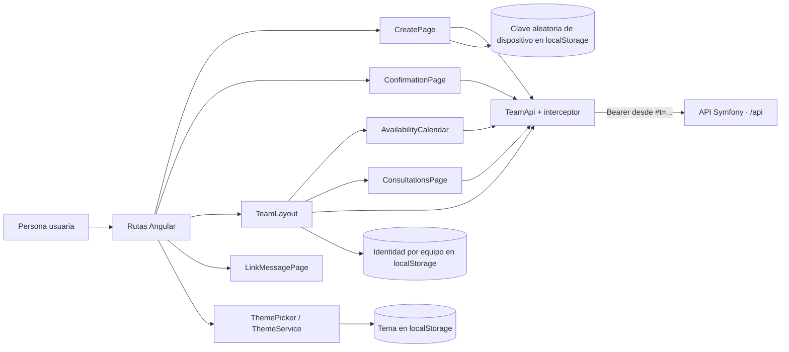
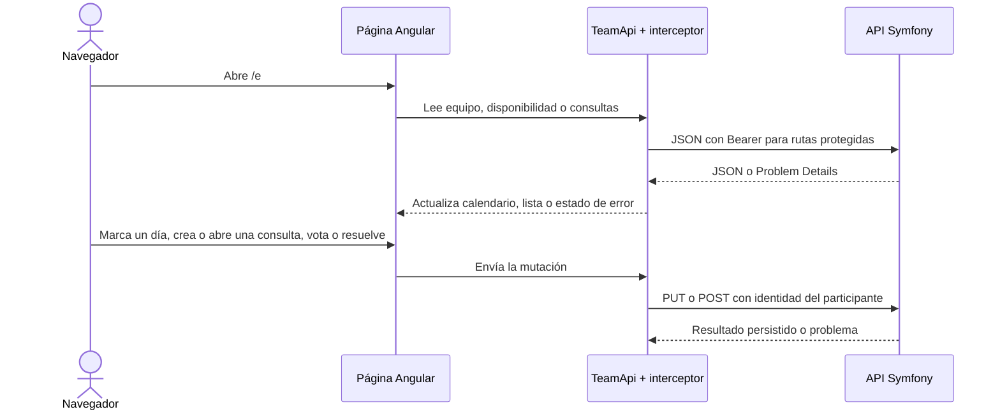

# Arquitectura del módulo WEB

WEB es una aplicación Angular 21 que se ejecuta en el navegador; Node.js 24 se usa para desarrollo y compilación. Conserva tema, identidad seleccionada y una clave aleatoria de origen para el límite de creación en el navegador y consume la API por HTTP. No accede directamente a PostgreSQL.

## Componentes

- **App y rutas:** `app.ts`, `app.routes.ts` y `app.config.ts` configuran navegación, tema y el interceptor HTTP. Hay páginas de creación, confirmación, equipo y estados de enlace.
- **CreatePage y ConfirmationPage:** permiten crear el equipo y copiar o compartir su enlace. CreatePage consulta `/api/configuration` para mostrar el máximo y la ventana de creación aplicables, y no habilita el envío hasta conocer esa configuración. Si la API rechaza una creación por superar el límite, muestra un aviso genérico para intentarlo más tarde. El campo de correo solo se presenta si la configuración pública lo habilita; ante error de consulta queda oculto. Cuando se usa, el recibo devuelto se recuerda por equipo en `localStorage` (`synqo-mail-attempt-<id>`, separado del enlace) y el resultado reciente se conserva en memoria durante la navegación.
- **MailAttemptNotice y MailAttemptTracker:** consultan `GET /api/mail-attempts/current` con el recibo mientras esté pendiente. Un fallo muestra el aviso con el enlace en la confirmación y en el equipo hasta que se descarte; el descarte se guarda con el recibo.
- **TeamLayout:** carga el equipo y presenta cabecera, selector de identidad, enlace y pestañas. La identidad activa se recuerda por equipo en `localStorage`; el secreto de acceso permanece en el fragmento URL.
- **AvailabilityCalendar:** lee las marcas y los recuentos por día, permite marcar o cambiar la disponibilidad propia y consultar el detalle. Desde el calendario se crea una consulta de fechas seleccionando entre una y diez fechas; el panel de edición se adapta a escritorio y móvil.
- **ConsultationsPage:** lista consultas de texto y fecha por estado, permite crear consultas con opciones de texto y abre el detalle de una consulta.
- **ConsultationDetailPage:** muestra opciones, recuentos y votantes; permite cambiar el voto propio en consultas abiertas. Presenta el diálogo de resolución y la lectura de resultados o rechazo cuando la consulta se cierra. Si falla una mutación, restaura el estado confirmado y ofrece reintento.
- **TeamApi e interceptor:** agrupan las peticiones JSON de configuración, equipo, disponibilidad y consultas. El interceptor lee `t` del fragmento y lo envía como Bearer en las llamadas `/api/`, salvo la configuración pública. Al crear equipo, `TeamApi` envía opcionalmente `X-Creation-Device`: una clave aleatoria de 256 bits generada con Web Crypto y persistida en `localStorage`, no una huella digital. Si el almacenamiento o Web Crypto no está disponible, omite esa cabecera y la API puede aplicar el límite por una IP confiable.
- **ThemePicker, ThemeService y LinkMessagePage:** gestionan el tema automático, claro u oscuro, y los mensajes de equipo caducado o enlace no encontrado.

## Recorrido HTTP

## Desarrollo

El build de producción se ejecuta con `npm --prefix apps/web run build`. Además de compilar Angular, conserva los avisos propios y de terceros dentro de `dist/web/browser/`, incluido el agregado que Angular genera fuera de esa carpeta. Las rutas y los límites de estos avisos están en el [inventario de procedencia y distribución](../legal/procedencia-y-avisos.md).

La interfaz cambia a su presentación móvil hasta 768 CSS px inclusive; desde 769 px usa la presentación de escritorio. La frontera y los recorridos completos están cubiertos por `apps/web/e2e/mobile-journey.spec.ts`; las comprobaciones parciales de teclado/foco, reflujo y ampliación de texto están en `apps/web/e2e/accessibility-smoke.spec.ts`. Estas pruebas usan viewports emulados en Chromium, no dispositivos móviles físicos. REL-001 se aceptó con una excepción documentada de accesibilidad; no se declara conformidad WCAG global. El objetivo de [RNF-COO-002 — Accesibilidad web WCAG 2.2 nivel AA](../../pdi_doc/03_requisitos/04_no-funcionales/COO/rnf-coo-002-accesibilidad-web.md) permanece vigente. Los comandos de instalación, servidor, pruebas, lint, formato y build están en el [README principal](../../README.md#desarrollo-local); las rutas y los recorridos Playwright están en `apps/web/src/app/` y `apps/web/e2e/`.

## Distribución de preproducción Railway

La imagen combinada copia el build Angular bajo `apps/api/public/` y Caddy publica ese directorio como raíz web. Las rutas relativas del cliente `/api/...` conservan el mismo origen y se enrutan al front controller Symfony; el fallback SPA se aplica a las rutas de navegación del navegador, nunca a rutas API. El empaquetado conserva dentro del artefacto los avisos de licencia de WEB, API y runtime. La guía operativa de REL-002 documenta publicación manual y pruebas observables.
