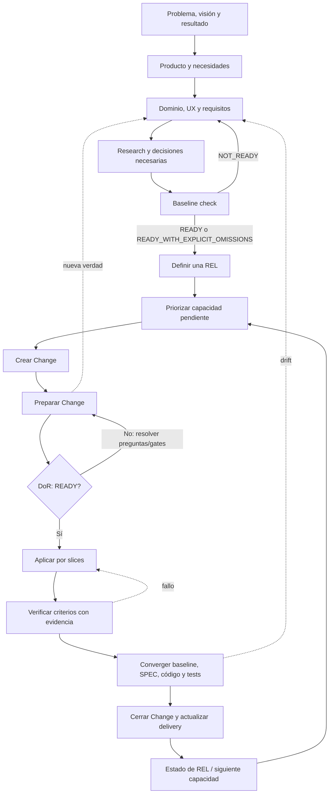
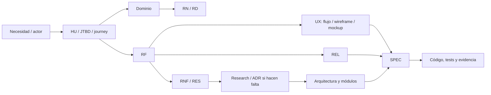
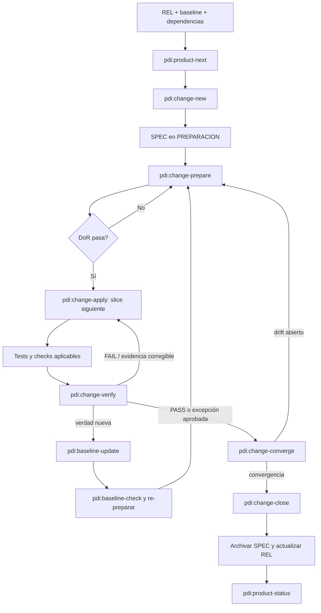
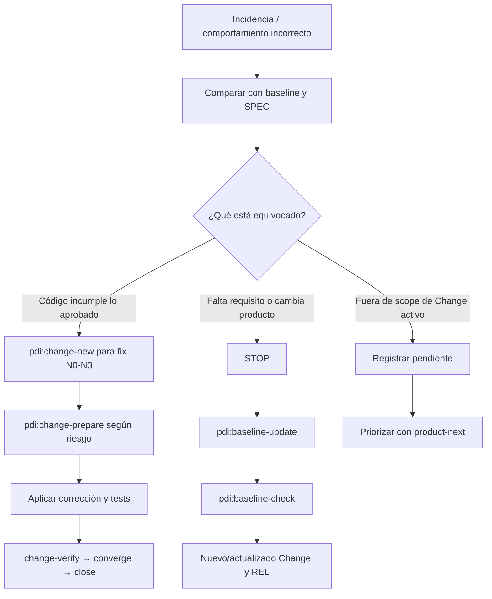

# Guía operativa PDI

Esta guía describe el flujo usado en Synqo desde la definición del producto hasta la entrega de cambios. PDI significa Product Design and Implementation. La verdad vigente del producto está en los artefactos de `pdi_doc/`; las skills coordinan su lectura, creación y validación. No todos los proyectos ni todos los cambios requieren todos los artefactos: se crean los necesarios según el riesgo y el alcance.

## Ciclo completo



## 1. Definir el producto e identificar capacidades

Se continúa desde el estado real de la documentación, no desde una plantilla vacía. `pdi:product-continue` localiza la primera fase pendiente, consulta su README y artefactos anteriores, registra `DEFINIDO / PROPUESTO / NO_RESUELTO / CONFLICTO` y conduce las preguntas necesarias. Cuando aparece una verdad normativa se crea o actualiza mediante `pdi:baseline-update`. `pdi:baseline-status` permite consultar lo ya decidido; `pdi:baseline-check` comprueba coherencia y readiness para un incremento concreto.

| Trabajo | Skills | Contexto de entrada | Artefactos que puede crear o actualizar |
|---|---|---|---|
| Problema, visión, objetivos y alcance inicial | `pdi:product-continue`, `pdi:baseline-update` | Estado documental, problema, personas y evidencia disponible | Problema, visión, objetivos, alcance, actores, JTBD, HU, journeys o PRD cuando aporten valor |
| Descubrir y clasificar funcionalidades | `pdi:product-continue`, `pdi:baseline-update` | Necesidades y lenguaje del dominio | Glosario, conceptos/estados/invariantes, RF, RN, RD, RNF, RES, flujos y artefactos UX enlazados |
| Resolver hechos o decisiones técnicas | `pdi:architecture-decision`, `pdi:baseline-update` | Drivers, baseline y evidencia | Research/alternativas y, si la decisión es arquitectónica, ADR y actualización de arquitectura/módulos/tecnologías |
| Consultar madurez y gate | `pdi:baseline-status`, `pdi:baseline-check` | Área o incremento elegido | Estado legible; el check informa `READY`, `NOT_READY` o `READY_WITH_EXPLICIT_OMISSIONS` y sus razones |

Los requisitos expresan comportamiento o restricciones verificables; no se inventan tecnologías en un RF. Una decisión sin resolver se conserva en el artefacto afectado con pregunta, motivo, opciones e impacto/gate. No se marca una propuesta como aprobada. Las categorías, áreas y enlaces siguen las [convenciones documentales](../pdi_doc/00_gobierno/01_convenciones-documentales.md) y el [catálogo de áreas](../pdi_doc/00_gobierno/06_catalogo-areas.md).

### Artefactos de referencia por capacidad



El diagrama muestra relaciones habituales, no una obligación de crear cada artefacto para toda capacidad. La skill y la categoría documental determinan la profundidad proporcional.

## 2. Definir la primera y las siguientes entregas

Cuando hay capacidades suficientes para describir un resultado entregable, `pdi:product-release` crea o actualiza una REL con objetivo, capacidades enlazadas, dependencias, estados iniciales de delivery y criterio de entregable. La REL reúne alcance de entrega; no reescribe RF/RN ni afirma implementación. `pdi:product-status` lee la REL, las SPEC y la evidencia disponible. `pdi:product-next` propone candidatos pendientes según readiness y dependencias; deja la priorización final a la persona impulsora cuando haya alternativas distintas.

Secuencia normal:

```text
pdi:product-release
→ pdi:product-status
→ pdi:product-next
→ pdi:baseline-check focal
→ pdi:change-new
```

La primera REL no tiene un proceso distinto: se crea desde el baseline disponible. Para una entrega sucesiva se consulta primero el estado de la REL anterior, se incorporan las nuevas capacidades mediante baseline-update si hace falta, se define la siguiente REL, y se ejecuta un nuevo check focal. Un resultado listo para preparar no significa que la entrega esté implementada o publicada.

Estados habituales de delivery:

```text
DEFINIDO → PLANIFICADO → ESPECIFICADO → EN_IMPLEMENTACION
         → IMPLEMENTADO → VALIDADO → ENTREGADO
```

`BLOQUEADO`, `POSPUESTO` y `DESCARTADO` son estados laterales con razón documentada. El cierre de un Change avanza solo la fila de REL que cubre con evidencia.

## 3. Preparar, implementar, verificar y cerrar un Change



| Fase | Skill y propósito | Entradas principales | Salida/artefactos |
|---|---|---|---|
| Iniciar Change | `pdi:change-new` expresa objetivo, clasifica N0–N3 y delimita scope | Capacidad REL, requisitos/decisiones enlazadas | N0: normalmente sin SPEC; N1/N2: una SPEC; N3: SPEC y documentos separados cuando ayuden. Estado inicial `preparacion` |
| Preparar / DoR | `pdi:change-prepare` resuelve preguntas, investiga, diseña, identifica estructura y plan | SPEC, baseline, READMEs de categorías/módulos y código si hace falta investigar estructura | Preguntas, Research, Design, Structure, slices/Plan, evidencia prevista; `READY_FOR_CHANGE_APPLY` o `BLOCKED`. No puede quedar una pregunta bloqueante abierta en READY |
| Aplicar | `pdi:change-apply` implementa una slice delimitada por vez | SPEC READY, plan, contrato del módulo, código y tests | Código, tests y evidencia/checks por slice; hallazgos de drift. No amplía scope ni cambia el baseline |
| Verificar | `pdi:change-verify` ejecuta pruebas y evalúa cada criterio | SPEC, criterios, código, estrategia de testing | Matriz `criterio | evidencia | resultado` con `PASS / FAIL / PARTIAL / NOT_TESTED / NOT_APPLICABLE`; `READY_FOR_CHANGE_CONVERGE`, `FAIL` o `BLOCKED` |
| Converger | `pdi:change-converge` compara intención, SPEC, código, tests y delivery | Baseline, SPEC, ADR, implementación y resultado de verificación | Clasificación/resolución de drift; `READY_FOR_CHANGE_CLOSE` o `BLOCKED` |
| Cerrar | `pdi:change-close` archiva el contexto temporal y registra cobertura real | SPEC convergida, REL y evidencia | SPEC archivada, fila REL actualizada al estado respaldado, enlaces de trazabilidad corregidos y resumen de cierre |

Las SPEC contienen objetivo, scope/fuera de scope, baseline enlazado, criterios observables, módulos, preguntas, research, diseño, plan y evidencia en proporción al nivel. En la misma ejecución que hace READY a una SPEC, `pdi:change-prepare` pregunta si se debe mantener/crear el índice opcional [11_trazabilidad.md](../pdi_doc/00_gobierno/11_trazabilidad.md); la respuesta no cambia el DoR. Para una solicitud explícita de implementación de una slice, este ciclo se complementa con el [workflow de Codex para vertical slices](ai/codex-workflow.md), sin saltar los gates PDI.

## 4. Avanzar por Change y sucesivas capacidades

Tras cerrar un Change, se vuelve a `pdi:product-status` para consultar cobertura de la REL y después a `pdi:product-next`. Se repite `change-new → change-prepare → change-apply → change-verify → change-converge → change-close` para el siguiente Change. Los artefactos de delivery indican cuál capacidad falta; la existencia de código, una SPEC o un commit no demuestra por sí sola que una fila esté validada o entregada.

Si una capacidad nueva aparece fuera de la REL actual, se identifica y formaliza con `pdi:product-continue` / `pdi:baseline-update`, se comprueba readiness, y se incorpora a la REL apropiada con `pdi:product-release`. No se añade una necesidad futura dentro de una SPEC activa solo para evitar iniciar otro Change.

## 5. Cambiar alcance después de iniciar trabajo

No se amplía en silencio una REL o SPEC empezada. Primero se identifica qué cambió:

- **Nueva capacidad o cambio de comportamiento:** parar en la frontera afectada, usar `pdi:baseline-update` para modificar la verdad normativa, volver a comprobar readiness y revisar la REL con `pdi:product-release`. Iniciar/preparar el Change correspondiente; si pertenece a otra capacidad, mantenerlo como Change separado.
- **Cambio del objetivo o composición de una REL:** actualizar objetivo, elementos, dependencias y criterio de entrega mediante `pdi:product-release`; consultar después `pdi:product-status` y ejecutar baseline-check focal. No cambiar RF/RN para que coincidan con un nuevo plan de delivery.
- **Detalle necesario para cumplir el mismo requisito dentro del Change:** resolverlo en `pdi:change-prepare` y actualizar la SPEC explícitamente antes de continuar. Si `change-apply` ya comenzó, detener esa slice, reabrir preparación y volver a superar DoR; para N3 solicitar la aprobación humana requerida. Si cambia la verdad del producto, el baseline-update es obligatorio.
- **Defecto fuera de scope:** registrarlo como trabajo pendiente y priorizarlo con `pdi:product-next` / su propio Change. Si bloquea la aceptación actual, no se incorpora automáticamente: se acuerda revisión explícita del alcance o se mantiene bloqueado.

Cambiar de plan nunca borra el alcance anterior ni evidencia ya observada: se registra qué se sustituyó, el motivo, las relaciones y el impacto en delivery.

## 6. Excepciones en verificación

`PASS` exige evidencia. `FAIL`, `PARTIAL` y `NOT_TESTED` no se convierten en PASS por conveniencia. Por defecto, una excepción abierta bloquea la aceptación del criterio o la entrega. Si la persona responsable acepta expresamente una excepción de delivery, se conserva:

- criterio afectado y parte no cumplida o no comprobada;
- evidencia disponible y límite de esa evidencia;
- motivo, riesgo residual e impacto;
- aceptación explícita de la persona autorizada y fecha;
- acción pendiente, si la hay, y si bloquea la REL o una entrega futura.

La SPEC registra el resultado y la justificación; la REL usa `VALIDADO CON EXCEPCIÓN` cuando ese estado describa la entrega. El criterio sigue como `PARTIAL`/`NOT_TESTED`: no se altera el baseline y no se afirma conformidad más amplia que la evidencia. Una excepción puntual de delivery no modifica un requisito vigente; cambiar la obligación para el producto necesita `pdi:baseline-update` y un nuevo check. Para ejemplos aplicados, consultar [REL-001 — Demo local operativa de Synqo](../pdi_doc/01_producto/10_entregas/rel-001-demo-local-operativa.md) y [SPEC-COO-002 — Smoke de accesibilidad responsive de REL-001](../pdi_doc/08_especificaciones/99_archivadas/spec-coo-002-accesibilidad-wcag-rel-001.md): se aceptó una excepción de delivery sin declarar conformidad WCAG 2.2 AA ni rebajar el objetivo normativo.

## 7. Flujo para fixes

PDI no tiene una skill independiente llamada “fix”. Una corrección sigue el mismo control proporcional:



Para N0 trivial `pdi:change-new` no exige SPEC salvo que ayude a conservar evidencia. N1/N2/N3 siguen los artefactos y gates normales; los arreglos de seguridad, datos, migraciones, contratos o concurrencia pueden elevar el nivel aunque el parche sea pequeño. Un fix que corrige un criterio fallido dentro del mismo scope puede continuar en la SPEC activa; un requisito nuevo no.

## Skills PDI en esta instalación

| Skill | Uso |
|---|---|
| `pdi:product-continue` | Descubrir y continuar la primera fase pendiente de definición del producto |
| `pdi:baseline-update` | Crear/modificar explícitamente la verdad normativa |
| `pdi:baseline-status` | Consultar baseline y madurez sin modificarlo |
| `pdi:baseline-check` | Validar coherencia y readiness focal |
| `pdi:architecture-decision` | Investigar alternativas y registrar una decisión arquitectónica mediante ADR |
| `pdi:module-define` | Definir responsabilidades y contratos de un módulo de solución |
| `pdi:product-release` | Definir o actualizar una REL y su scope de delivery |
| `pdi:product-status` | Consultar cobertura, pendientes y bloqueos de una REL |
| `pdi:product-next` | Proponer el siguiente Change candidato |
| `pdi:change-new` | Abrir un Change proporcional al riesgo |
| `pdi:change-prepare` | Resolver preguntas, Research, Design, Structure, Plan y DoR |
| `pdi:change-apply` | Implementar una SPEC READY por slices |
| `pdi:change-verify` | Validar criterios con evidencia y checks |
| `pdi:change-converge` | Resolver discrepancias entre baseline, SPEC e implementación |
| `pdi:change-close` | Archivar Change y actualizar coverage de REL |

## Si aparece nueva verdad o una decisión bloqueante

```text
STOP en la frontera afectada
→ registrar pregunta/impacto/opciones en el artefacto
→ pdi:baseline-update (si cambia verdad normativa)
→ pdi:baseline-check focal
→ volver a pdi:change-prepare
```

No se pasa un gate por silencio, inferencia o preferencia del agente. No se actualizan requisitos para justificar código divergente.

## Mandamientos diarios

1. No implementar una decisión funcional que no esté en el baseline o en la SPEC aprobada.
2. Research aporta hechos; no aprueba una decisión.
3. `pdi:baseline-update` es la puerta para cambiar verdad normativa.
4. No saltar preguntas bloqueantes ni DoR/DoD.
5. No refactorizar ni ampliar scope por conveniencia.
6. Leer reglas de los módulos afectados antes de implementar.
7. `Test` ≠ `Verify` ≠ `Converge`.
8. Baseline ≠ implementación: usar REL para cobertura de delivery.
