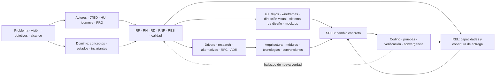

# Mapa operativo rápido

## Mapa de artefactos



Las flechas muestran de dónde obtiene contexto cada artefacto; no obligan a crear todos ni imponen un proceso lineal. Una misma capacidad puede requerir varios artefactos y una SPEC puede reunir requisitos de varias áreas. UX y decisiones técnicas pueden avanzar en paralelo. Los enlaces entre archivos hacen explícitas las relaciones concretas; el diagrama solo muestra el patrón. El [Playbook de documentación](01_playbook-documentacion.md) define el Product Baseline y el [Playbook de implementación](02_playbook-implementacion.md) define su materialización.

### Qué expresa cada artefacto

| Artefacto | Qué expresa y con qué se relaciona | Qué no sustituye; cuándo aparece |
|---|---|---|
| Problema, visión, objetivos y alcance | Motivo, dirección, resultado esperado y límites del producto; orientan el resto. | No describen pantallas ni implementación. Aparecen al iniciar el producto y se revisan si cambia su propósito. |
| Actor/persona | Quién participa o se beneficia; da contexto a JTBD, HU y journeys. | No equivale a una cuenta técnica ni impone autenticación. Aparece al reconocer roles relevantes. |
| JTBD | Progreso que una persona busca en una situación; ayuda a descubrir capacidades y HU. | No es una función de la aplicación ni una lista de pantallas. Aparece al comprender la necesidad. |
| HU | Necesidad concreta de un actor y resultado esperado; enlaza JTBD con requisitos y UX. | No especifica por sí sola reglas, datos ni solución técnica. Aparece cuando una capacidad necesita detalle. |
| Journey | Recorrido de la persona a través de situaciones y momentos; ayuda a ordenar flujos. | No es un contrato de API ni un único wireframe. Aparece si el recorrido completo aporta contexto. |
| PRD | Vista integrada del producto que enlaza objetivos, alcance y capacidades. | No copia todos los RF ni define arquitectura. Aparece cuando hace falta una lectura ejecutiva conjunta. |
| Dominio: glosario, conceptos, estados, invariantes y eventos | Lenguaje y reglas conceptuales compartidos; alimentan RN, RD y flujos. | No son tablas, clases ni mensajes de infraestructura. Aparecen cuando la capacidad requiere un modelo común. |
| RF | Comportamiento observable que debe ofrecer el producto; deriva de necesidades y se verifica en una SPEC. | No prescribe componentes o endpoints. Aparece al concretar una capacidad funcional. |
| RN | Condición o invariante del negocio que rige uno o varios RF. | No describe el mecanismo técnico de aplicación. Aparece cuando una regla debe mantenerse en distintos recorridos. |
| RD | Significado, integridad y ciclo de vida de un dato necesario para RF o RN. | No es todavía un esquema SQL. Aparece cuando el dato importa para el comportamiento o la conservación. |
| RNF, RES y atributos de calidad | RNF define una propiedad verificable; RES, un límite impuesto; el atributo de calidad conecta propiedades con decisiones de arquitectura. | No son preferencias vagas ni tecnologías elegidas sin justificación. Aparecen al identificar calidad o límites relevantes. |
| UX: arquitectura de información y flujos | Organización del contenido y pasos, estados y errores de una interacción; conectan RF/RN con pantallas. | No fijan acabado visual ni sustituyen requisitos. Aparecen antes de detallar pantallas. |
| Wireframe | Estructura y jerarquía de una pantalla o estado de un flujo. | No aprueba colores, tipografía ni comportamiento nuevo. Aparece cuando conviene validar distribución. |
| Dirección visual, sistema de diseño y mockup | La dirección explora el aspecto; el sistema consolida reglas reutilizables; el mockup muestra su aplicación a una vista. | Ninguno sustituye RF/RN ni prueba accesibilidad por sí solo. Aparecen al concretar UX, antes de la implementación visual correspondiente. |
| Accesibilidad UX | Criterios de interacción y presentación aplicados al diseño; concreta RNF pertinentes. | No es una certificación automática por tener mockups. Aparece desde el diseño y se verifica en la aplicación. |
| PA e HIP | PA registra una cuestión sin resolver; HIP, una suposición que requiere validación. | No son decisiones aprobadas. Aparecen al detectar incertidumbre y se resuelven o descartan con evidencia. |
| Research, spike y alternativas | Evidencia, experimento acotado y comparación de opciones; alimentan una decisión. | No convierten la opción preferida en norma. Aparecen cuando una incertidumbre importa para el siguiente incremento. |
| RFC y ADR | RFC abre la deliberación; ADR registra una decisión arquitectónica significativa aceptada, con contexto y consecuencias. | Un RFC no es una decisión; un ADR no reemplaza research ni requisitos. Aparecen según impacto y necesidad de consenso. |
| Arquitectura, módulos, tecnologías y convenciones | Responsabilidades, límites, dependencias y reglas de construcción derivados de decisiones aceptadas. | No son un inventario especulativo de clases ni justifican retroactivamente una tecnología. Aparecen antes del Change que los necesita. |
| REL | Conjunto de capacidades objetivo y su cobertura de delivery; reúne referencias al baseline y a las SPEC que las realizan. | No cambia el estado documental de los RF ni exige cerrar todas las SPEC antes de implementar. Aparece al planificar una entrega. |
| SPEC | Contrato temporal de un Change: alcance, baseline enlazado, diseño, plan y evidencia esperada. | No duplica ni sustituye la verdad normativa. Aparece al preparar un cambio concreto; pasa a implementación solo tras su DoR. |
| Código, pruebas y evidencia | Materializan y comprueban la SPEC contra el baseline; la convergencia resuelve discrepancias. | El código no decide por sí solo lo que el producto debe ser. Aparecen durante aplicación y verificación del Change. |
| CAM e historial | Registran cambios relevantes, migraciones y sustituciones para conservar el porqué. | No son la fuente vigente de comportamiento. Aparecen cuando ocurre un cambio que requiere memoria. |

El Product Baseline contiene la verdad normativa vigente, no automáticamente research, propuestas o SPEC históricas. `REL` sigue el estado de entrega sin modificar esa verdad. Si un Change descubre una necesidad o decisión nueva, se incorpora mediante `pdi:baseline-update` y se vuelve a comprobar la preparación de la SPEC.

Si se necesita una vista transversal, `<DOC>/00_gobierno/11_trazabilidad.md` es un índice opcional: una fila de enlaces por cada artefacto relacionado con una SPEC preparada. `pdi:change-prepare` pregunta al alcanzar READY si se crea o actualiza; `pdi:baseline-update` corrige las relaciones afectadas cuando ya existe, y `pdi:change-close` conserva los enlaces al archivar la SPEC. No contiene estados ni descripciones de los artefactos.

## Definición de producto

```text
pdi:product-continue
        ↓
¿falta una verdad concreta?
        ↓ sí
pdi:baseline-update
        ↓
pdi:baseline-status
        ↓
pdi:baseline-check
```

## Release / MVP

```text
pdi:product-release
→ pdi:product-status
→ pdi:product-next
```

## Implementación

```text
pdi:change-new
→ pdi:change-prepare
→ READY?
   ├─ no → resolver
   └─ sí → pdi:change-apply
            → pdi:change-verify
            → pdi:change-converge
            → pdi:change-close
```

## Si aparece nueva verdad durante un Change

```text
hallazgo
→ STOP en la frontera afectada
→ pdi:baseline-update
→ volver a pdi:change-prepare
```

## Si aparece arquitectura nueva

```text
Question
→ Research
→ Options
→ Decision
→ ADR
→ pdi:baseline-update
```

## Mandamientos globales

1. No implementar sin READY cuando el nivel lo exige.
2. No inventar producto desde el código.
3. No modificar baseline fuera de `pdi:baseline-update`.
4. No elegir tecnología antes de drivers.
5. No saltar preguntas bloqueantes.
6. No refactorizar fuera de scope.
7. No cerrar Change sin verificar/converger cuando aplica.
8. No confundir baseline con estado de implementación.
9. No duplicar la misma verdad en varios sitios.
10. Si dudas entre asumir y preguntar/investigar, clasifica primero la incertidumbre.
