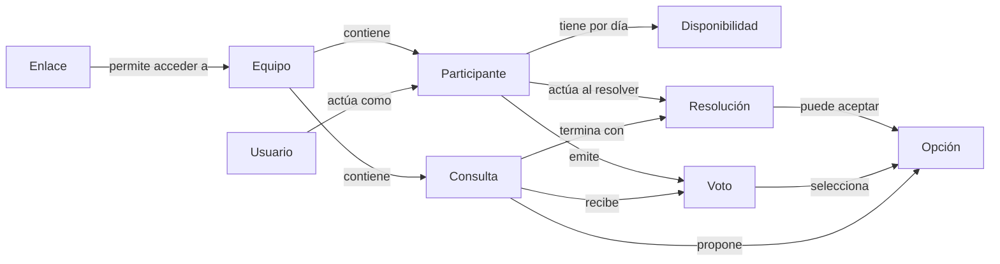

# Modelo conceptual de coordinación de Synqo

**Origen:** [glosario de coordinación](../01_glosario-dominio/glosario-coordinacion.md) y [alcance conceptual de Synqo](../../01_producto/04_alcance/alcance-conceptual.md).

## Conceptos

Usuario, equipo rápido, enlace de acceso, participante, disponibilidad, visor de disponibilidad, consulta, opción de consulta, voto, resolución de consulta y fecha prevista de caducidad se definen en el glosario.

## Relaciones

- Un equipo tiene un nombre que puede repetirse, un UUID propio según [RD-EQU-007 — Identificador del equipo](../../03_requisitos/03_datos/EQU/rd-equ-007-identificador-equipo.md) y reúne identidades de participante, disponibilidades y consultas. Se crea junto a su primer participante y no muestra contenido operativo si excepcionalmente carece de participantes, según [RN-EQU-005 — Equipo con al menos un participante](../../03_requisitos/02_reglas-negocio/EQU/rn-equ-005-equipo-con-participante.md).
- El correo opcional informado al crear un equipo solo sirve para enviarle el enlace; no forma parte de los datos persistentes del equipo, según [RD-EQU-005 — Correo transitorio para enviar el enlace](../../03_requisitos/03_datos/EQU/rd-equ-005-correo-transitorio-enlace.md).
- El enlace único permite acceder al equipo mientras está vigente. No se presupone que su dirección contenga el UUID. El equipo muestra su fecha prevista de caducidad y sigue el [ciclo de vida del equipo](../04_estados-transiciones/equipo.md).
- Un usuario con acceso al equipo puede actuar bajo una identidad de participante y cambiarla. La relación no es exclusiva. La última identidad elegida se recuerda para ese equipo en el navegador utilizado.
- La disponibilidad se atribuye a un participante del equipo y a un día; no pertenece a una consulta.
- Una consulta pertenece a un equipo y presenta al menos una opción; en la primera entrega tiene un título breve y opciones de fecha o de texto. En una consulta de fechas, cada opción corresponde a hoy o al futuro al crearla y no se repite.
- En esta fase, cada voto puede seleccionar una o varias opciones de su consulta.
- Un voto pertenece a una consulta, se atribuye a un participante del equipo y selecciona una o varias de sus opciones.
- Una resolución pertenece a una consulta y acepta una o varias de sus opciones propuestas, o la rechaza. Se atribuye a la identidad de participante bajo la que actuó el usuario que resolvió.

## Diagrama

## Propuesta fuera del modelo actual

Se ha propuesto rechazar posteriormente una resolución, sin definir su significado ni incorporarlo al ciclo de vida actual.
