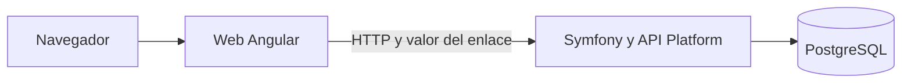

# Visión general de la demo local

> La estructura tecnológica está decidida en el ADR enlazado; los contratos y límites internos de los módulos se concretarán antes de implementar.

Para [REL-001 — Demo local operativa de Synqo](../../01_producto/10_entregas/rel-001-demo-local-operativa.md), [ADR-COO-001 — Separar interfaz web y API para la demo local](../../05_investigacion-y-decisiones/05_adr/adr-coo-001-estructura-demo-local.md) establece tres componentes en este repositorio: web Angular, servidor Symfony con API Platform y PostgreSQL.

La web gestiona navegación, temas, identidad recordada y estado visual. La API aplica acceso, reglas de equipo, disponibilidad, consultas, caducidad y borrado. PostgreSQL conserva equipos, participantes, marcas y consultas entre reinicios. La web no es la autoridad de los votos ni de los recuentos finales: tras cada mutación confirma el resultado de la API o restaura el estado anterior y ofrece reintentar, según los requisitos de cada capacidad.

[ADR-COO-002 — Separar el dominio con arquitectura limpia y DDD pragmático](../../05_investigacion-y-decisiones/05_adr/adr-coo-002-arquitectura-limpia-y-ddd-pragmatico.md) fija la dirección de las dependencias dentro de los módulos: reglas y casos de uso en el núcleo, API Platform y Doctrine como adaptadores del servidor, Angular como presentación y cliente de la API. Los puertos se introducen donde una dependencia externa o una prueba lo justifica. La [guía de aplicación de estos principios](../../07_desarrollo/01_principios-y-convenciones/arquitectura-limpia-y-ddd.md) concreta su uso sin imponer una estructura de carpetas prematura.

El intercambio entre WEB y API sigue [ADR-COO-003 — Usar JSON y Problem Details como contrato de la API](../../05_investigacion-y-decisiones/05_adr/adr-coo-003-json-y-problem-details-como-contrato-api.md); OpenAPI describe las operaciones, sus entradas, salidas y errores. La API y PostgreSQL se ejecutan con Docker Compose en desarrollo local, mientras Angular usa Node local según las [tecnologías de la demo local](../08_tecnologias/demo-local.md).

[ADR-EQU-001 — Separar el identificador del equipo de su valor de acceso](../../05_investigacion-y-decisiones/05_adr/adr-equ-001-separar-identidad-y-acceso.md) separa el UUID del equipo del valor que concede acceso. [ADR-EQU-003 — Verificar el valor del enlace en cada operación de la API](../../05_investigacion-y-decisiones/05_adr/adr-equ-003-verificar-enlace-en-api.md) fija su transporte en el enlace y su comprobación en cada operación del equipo. El correo real y el alojamiento público quedan fuera de esta entrega.

## Límites pendientes de concretar

Los módulos, el esquema y los contratos HTTP se definirán antes de codificar la primera capacidad. La ejecución de limpieza local debe permitir pruebas con tiempo controlado; su estrategia exacta también se concretará en el módulo de API.
