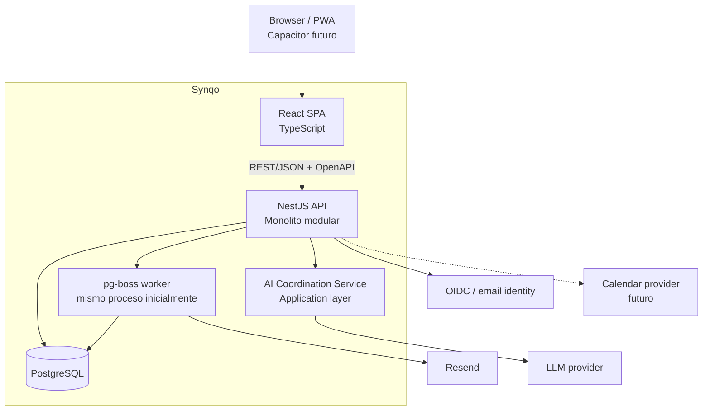

# Container View

```mermaid
flowchart TB
    USER[Browser / PWA\nCapacitor futuro]
    subgraph APP[Synqo]
      WEB[React SPA\nTypeScript]
      API[NestJS API\nMonolito modular]
      JOBS[pg-boss worker\nmismo proceso inicialmente]
      DB[(PostgreSQL)]
      AIAPP[AI Coordination Service\nApplication layer]
    end
    EMAIL[Resend]
    IDP[OIDC / email identity]
    LLM[LLM provider]
    CAL[Calendar provider\nfuturo]

    USER --> WEB
    WEB -->|REST/JSON + OpenAPI| API
    API --> DB
    API --> JOBS
    JOBS --> DB
    JOBS --> EMAIL
    API --> IDP
    API --> AIAPP
    AIAPP --> LLM
    API -.-> CAL
```

El componente AI no es un microservicio: es una responsabilidad interna detrás de un puerto/adaptador y puede deshabilitarse sin afectar al core.
