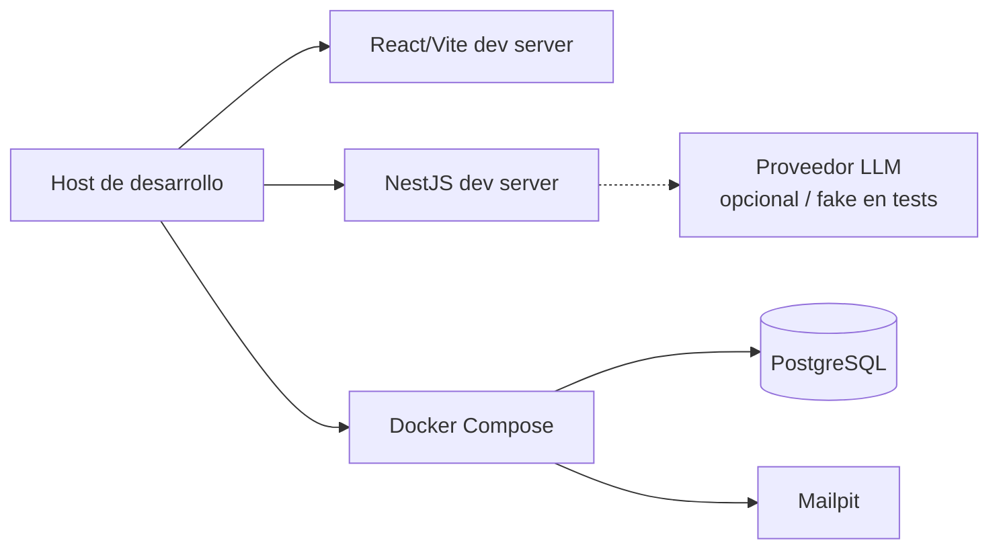
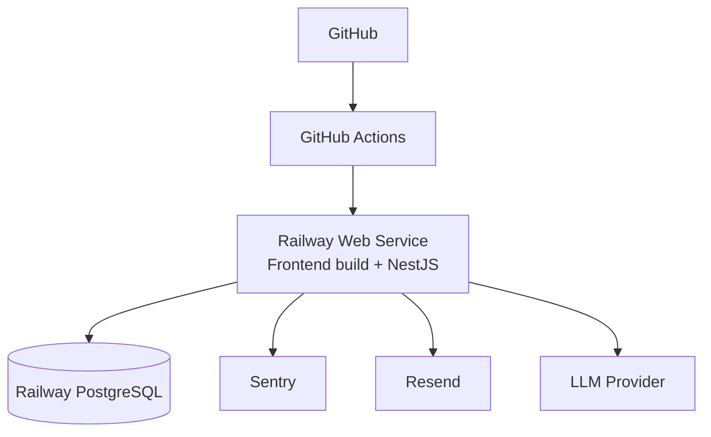

# Deployment View

## Desarrollo

```mermaid
flowchart LR
    DEV[Host de desarrollo]
    WEB[React/Vite dev server]
    API[NestJS dev server]
    DC[Docker Compose]
    DB[(PostgreSQL)]
    MAIL[Mailpit]
    LLM[Proveedor LLM\nopcional / fake en tests]
    DEV --> WEB
    DEV --> API
    DEV --> DC
    DC --> DB
    DC --> MAIL
    API -.-> LLM
```

## Producción inicial

```mermaid
flowchart TB
    GH[GitHub]
    CI[GitHub Actions]
    RW[Railway Web Service\nFrontend build + NestJS]
    DB[(Railway PostgreSQL)]
    SENTRY[Sentry]
    RESEND[Resend]
    LLM[LLM Provider]
    GH --> CI
    CI --> RW
    RW --> DB
    RW --> SENTRY
    RW --> RESEND
    RW --> LLM
```
