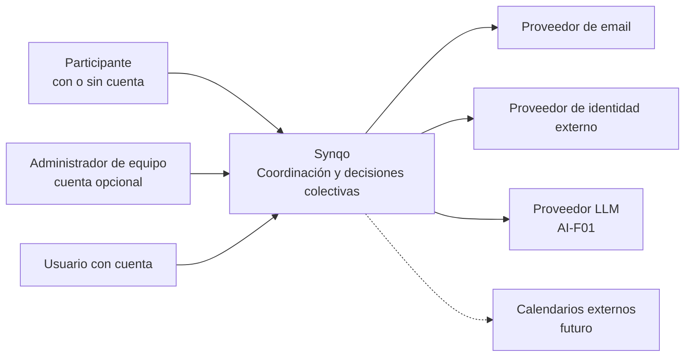

# System Context

```mermaid
flowchart LR
    P[Participante\ncon o sin cuenta]
    A[Administrador de equipo\ncuenta opcional]
    U[Usuario con cuenta]
    APP[Synqo\nCoordinación y decisiones colectivas]
    EMAIL[Proveedor de email]
    IDP[Proveedor de identidad externo]
    AI[Proveedor LLM\nAI-F01]
    CAL[Calendarios externos\nfuturo]

    P --> APP
    A --> APP
    U --> APP
    APP --> EMAIL
    APP --> IDP
    APP --> AI
    APP -.-> CAL
```

Los tres actores humanos representan formas de interacción y pueden corresponder a la misma persona en distintos contextos.
