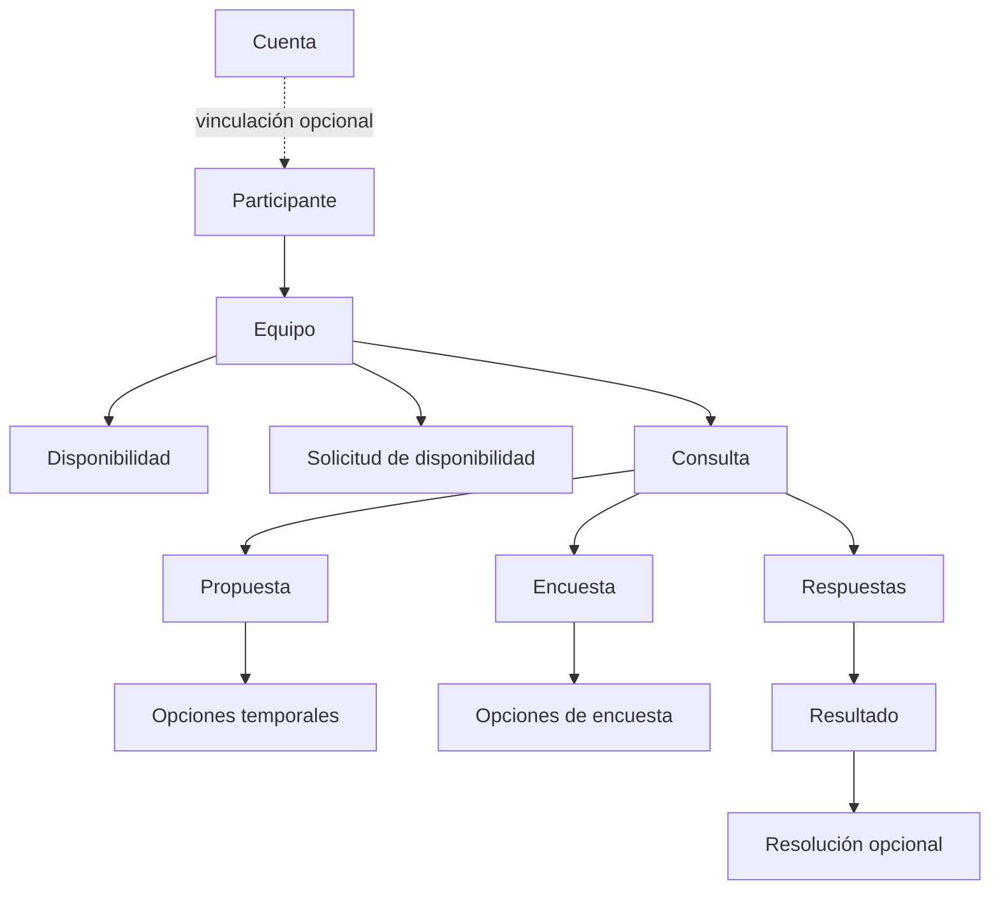

# 06 — Modelo conceptual de dominio

Este documento describe conceptos de producto y relaciones; no prescribe clases, tablas ni agregados técnicos.

## Equipo como contexto principal

Un equipo contiene conceptualmente participantes, disponibilidad, solicitudes, propuestas, encuestas e histórico. El evento posterior a una resolución no necesita ser una entidad central del MVP.

## Identidad

Una `Cuenta` tiene alcance global. Un `Participante` tiene alcance local a un equipo. Vincular una cuenta no sustituye ni recrea el participante; por ello el histórico permanece asociado a la misma identidad local.

## Modalidad y autenticación son dimensiones distintas

Son válidas las cuatro combinaciones: persona con/sin cuenta × equipo rápido/administrable. La modalidad de equipo no depende de la existencia de una cuenta.

## Consulta como abstracción funcional

`Propuesta` y `Encuesta` comparten equipo, creador, opciones, respuestas, resultado y resolución. Esto no obliga a usar herencia o una tabla única durante la implementación.

## Pendientes

`Pendiente` se considera preferentemente información derivada de solicitudes/consultas abiertas y de la respuesta del participante; no requiere una entidad persistente propia salvo necesidad técnica posterior.
