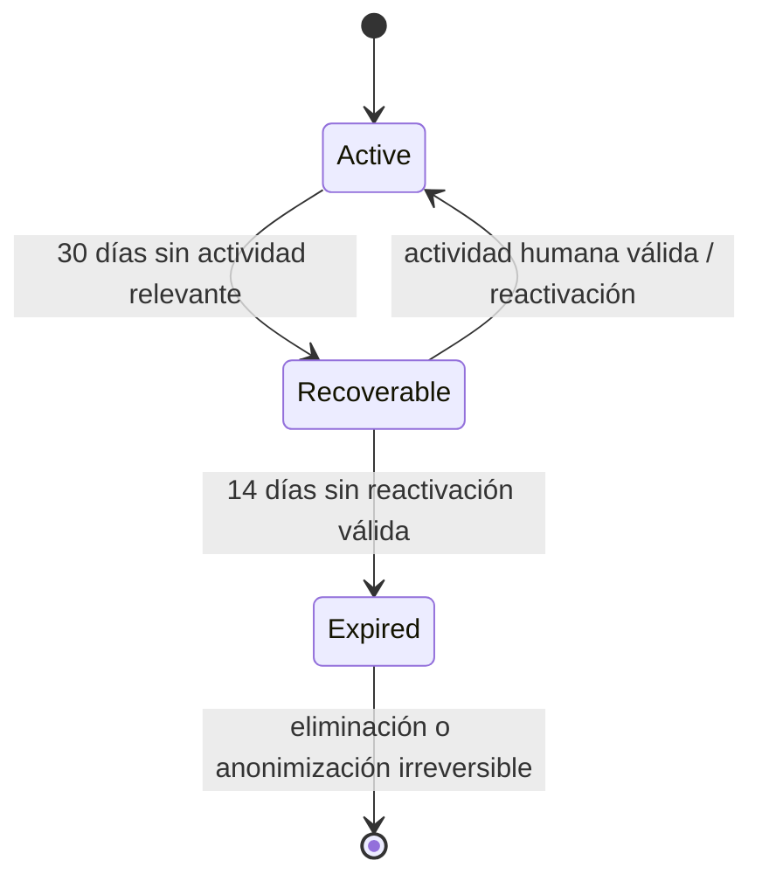
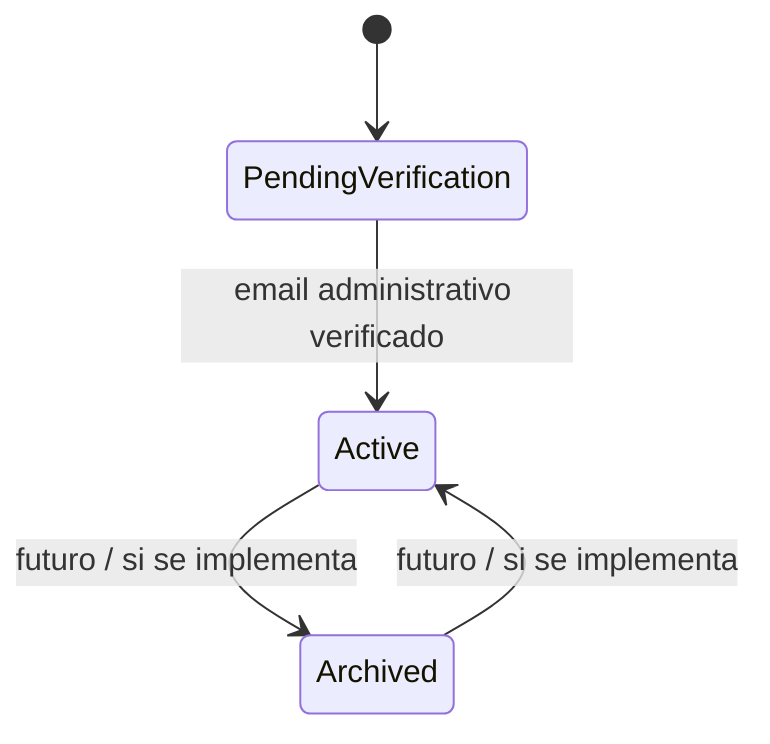
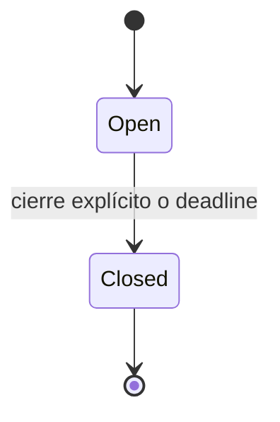

# 08 — Ciclos de vida

## Equipo rápido



Vincular el equipo rápido a una cuenta no altera este ciclo. La actividad relevante debe ser una interacción humana intencional: crear o identificar participante, actualizar disponibilidad, responder, votar, crear solicitud o consulta, resolver, cancelar, vincular a cuenta o confirmar reactivación. Visitas pasivas, previews de enlaces, bots, jobs y automatismos no renuevan actividad.

Durante `Recoverable`, el equipo conserva su información para permitir reactivación. Al entrar en `Expired`, deja de ser recuperable y sus datos de dominio y credenciales de acceso se eliminan o anonimizan de forma irreversible, conservando como máximo métricas agregadas y trazas operativas mínimas sin tokens ni PII innecesaria.

## Equipo administrable



La inactividad ordinaria no provoca expiración automática.

## Solicitud de disponibilidad



`Draft` puede ser únicamente un estado de interfaz y no obliga a persistencia.

## Consulta

La consulta se representa mediante dos ejes:

```text
participation: OPEN | CLOSED
resolution:    PENDING | RESOLVED | CANCELLED
```

Combinaciones válidas:

| Participación | Resolución | Interpretación |
|---|---|---|
| OPEN | PENDING | consulta en curso |
| CLOSED | PENDING | ya no admite respuestas; esperando decisión |
| CLOSED | RESOLVED | decisión final registrada |
| CLOSED | CANCELLED | cancelada conservando histórico |

Resolver o cancelar fuerza `CLOSED`.
