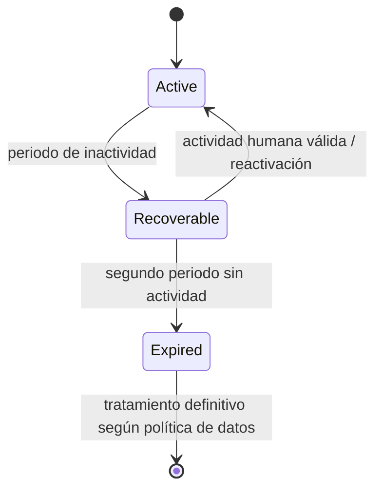
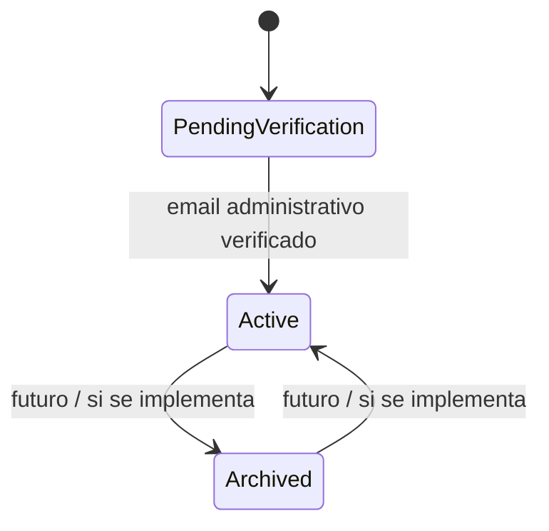
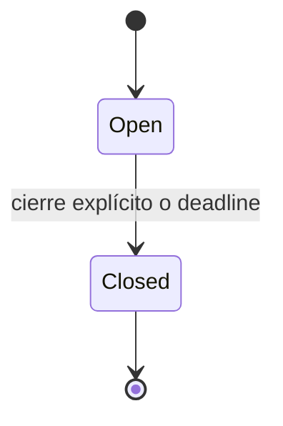

# 08 — Ciclos de vida

## Equipo rápido



Los plazos concretos y la definición exacta de actividad válida están abiertos (`OPEN-01`, `OPEN-02`). Vincular el equipo a una cuenta no altera este ciclo.

## Equipo administrable



La inactividad ordinaria no provoca expiración automática.

## Solicitud de disponibilidad



`Draft` puede ser únicamente un estado de interfaz y no obliga a persistencia.

## Consulta

La consulta se representa mediante dos ejes:

```text
participation: OPEN | CLOSED
resolution:    PENDING | RESOLVED | CANCELLED
```

Combinaciones válidas:

| Participación | Resolución | Interpretación |
|---|---|---|
| OPEN | PENDING | consulta en curso |
| CLOSED | PENDING | ya no admite respuestas; esperando decisión |
| CLOSED | RESOLVED | decisión final registrada |
| CLOSED | CANCELLED | cancelada conservando histórico |

Resolver o cancelar fuerza `CLOSED`.
