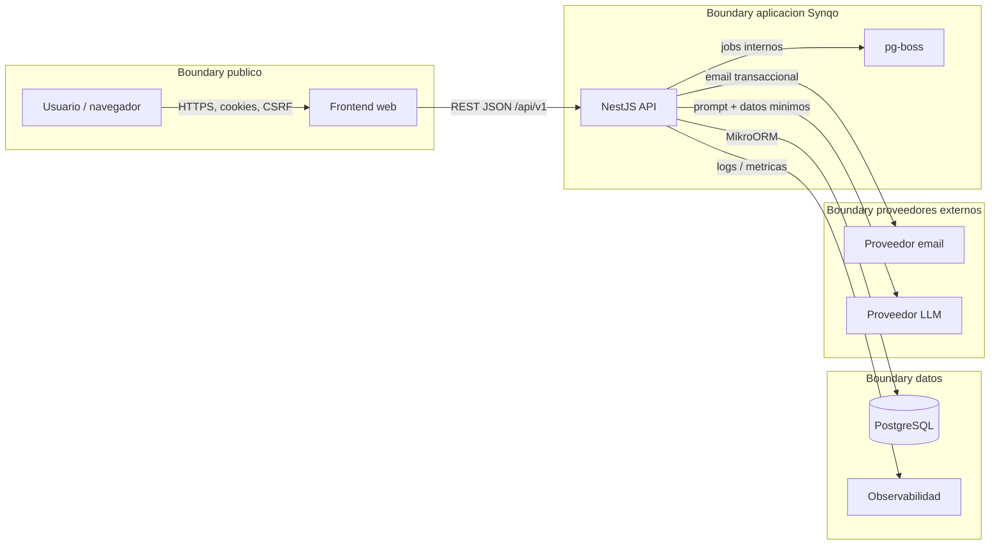

# 22 - Threat Model

## 1. Proposito

Este documento concreta el modelo de amenazas practico de Synqo para el MVP. Parte de ADR-015, ADR-021, ADR-022, la matriz de autorizacion, el diseno de identidad/sesiones y el contrato OpenAPI inicial.

El foco principal son:

- enlaces bearer y canje de credenciales opacas;
- identidades locales sin cuenta;
- sesiones contextuales de participante y administracion;
- autorizacion por equipo;
- endpoints publicos necesarios para baja friccion.

No cambia el alcance funcional ni introduce mecanismos arquitectonicos nuevos.

## 2. Alcance

### Incluido

- Web/PWA MVP con cookies server-side.
- `PublicLink`, `IdentifiedLink`, `VerificationLink` y `RecoveryLink`.
- `ParticipantSession`, `AdministrativeSession` y `AccountSession`.
- Endpoints publicos del contrato: crear equipos, crear/identificar participante, canjear acceso, verificar admin, solicitar recovery y recuperar admin.
- Operaciones contextuales de disponibilidad, consultas, resultados, resolucion, settings y enlaces.
- Integracion con email transaccional y proveedor LLM para interpretacion de lenguaje natural.

### Fuera de alcance

- Cliente nativo Capacitor futuro.
- Microservicios, API publica de terceros, RAG, agentes autonomos o chat.
- Voto anonimo fuerte, recurrencia automatica y subgrupos arbitrarios.

## 3. Trust Boundaries

### Fronteras criticas

| Boundary | Cruce | Riesgo principal | Control base |
|---|---|---|---|
| Navegador -> API | Cookies, CSRF, token URL canjeado | CSRF, fixation, fuga de token, XSS | TLS, `HttpOnly`, `Secure`, `SameSite`, token CSRF, clean redirect, CSP |
| Publico -> endpoints sin sesion | Creacion/canje/recovery | abuso, enumeracion, spam, replay | rate limiting, respuestas genericas, idempotencia, scope/TTL |
| API -> DB | Datos y credenciales hasheadas | IDOR, inyeccion, corrupcion | autorizacion server-side, validacion, transacciones, constraints |
| API -> jobs | expiracion/cierre/limpieza | carreras, ejecucion indebida | jobs idempotentes, locks, transiciones validas |
| API -> email | PII minima + enlaces | fuga de tokens, enumeracion, spam | tokens one-time/corto TTL, plantillas sin secretos extra, rate limit |
| API -> LLM | texto usuario + contexto minimo | fuga de PII, prompt injection, output malicioso | minimizacion, contrato estructurado, validacion determinista |
| API -> logs/metricas | trazas y eventos | logging leakage | redaccion de tokens/PII, no analytics con tokens |

## 4. Activos sensibles

| Activo | Sensibilidad | Motivo | Control esperado |
|---|---|---|---|
| Token claro de enlace identificado/admin/recovery | Alta | Concede identidad o capacidad contextual si se canjea | No persistir en claro, clean redirect, no logs, TTL/scope/revocacion |
| Hash de credenciales de acceso | Alta | Permite validar tokens si se combina con secreto servidor | HMAC/pepper, acceso restringido DB |
| `ParticipantSession` | Alta | Permite actuar como participante local | Cookie `HttpOnly`, rotacion, revocacion, autorizacion por equipo |
| `AdministrativeSession` | Muy alta | Permite configurar o resolver segun politicas | TTL corto, rotacion, revocacion, verificacion server-side |
| `AccountSession` | Alta | Agrega equipos y pendientes de cuenta | Cookie segura, rotacion en login, logout |
| Email admin/cuenta | Alta | Dato personal y canal de recuperacion | minimizacion, respuestas genericas, no exposicion a participantes |
| Disponibilidad nominal | Media-alta | Revela disponibilidad individual | solo participantes activos/admin segun politica |
| Resultados/votos nominales | Media-alta | Revela preferencias individuales | visibilidad segun consulta y permisos |
| Configuracion de equipo administrable | Media | Define politicas de creacion/resolucion | solo admin verificado para mutar |
| Eventos de auditoria/seguridad | Media-alta | Pueden contener metadatos sensibles | minimizacion, redaccion, acceso restringido |

## 5. Supuestos de seguridad

- Todo trafico usa HTTPS en entornos desplegados.
- La sesion real es opaca y server-side; no se usan JWT como mecanismo principal.
- La API valida autorizacion en cada operacion aunque la UI oculte acciones.
- Las referencias publicas no son secuenciales y nunca sustituyen `teamId`/scope checks.
- Los tokens sensibles se tratan como secretos solo hasta el canje; despues la URL queda limpia.
- El proveedor LLM no decide disponibilidad, votos ni resoluciones; el dominio determinista valida y calcula.

## 6. STRIDE Threat Register

Probabilidad: `Baja`, `Media`, `Alta`. Riesgo: combinacion cualitativa de probabilidad e impacto.

| ID | STRIDE | Amenaza | Escenario | Impacto | Prob. | Riesgo | Controles preventivos | Controles detectivos | Tests |
|---|---|---|---|---|---|---|---|---|---|
| `TM-01` | Information Disclosure / Spoofing | Token leakage en URL | Un `IdentifiedLink`, `VerificationLink` o `RecoveryLink` queda en historial, referrer, preview, analytics o logs. | Toma de identidad local/admin antes de expirar. | Media | Alto | Token opaco aleatorio, TTL/scope minimo, persistencia hasheada, clean redirect obligatorio, `Referrer-Policy` restrictiva, redaccion de query/body sensibles, no analytics antes de limpiar URL. | Alertas por patron de token en logs, metricas de canjes fallidos/excesivos, auditoria de `lastExchangedAt`. | E2E de canje verifica redirect sin token; test de logging redacted; test de headers; test de analytics deshabilitada en rutas con token. |
| `TM-02` | Spoofing / Replay | Replay de token one-time | Un atacante reutiliza un token de verificacion/recovery capturado o hace doble submit concurrente. | Verificacion o recuperacion indebida. | Media | Alto | `usedAt` transaccional, constraint sobre token hash/scope, validacion de expiracion/revocacion, idempotencia controlada, rotacion de sesiones tras canje. | Eventos de replay rechazado, ratio de `TOKEN_EXPIRED_OR_USED`, auditoria de IP prefix/user-agent minimizados. | Test concurrente: dos canjes del mismo recovery, solo uno crea sesion; test posterior devuelve `TOKEN_EXPIRED_OR_USED`. |
| `TM-03` | Spoofing | Impersonation de participante | Un usuario intenta reclamar o editar otra participacion por nombre, `participantRef` o link compartido. | Respuestas/votos/disponibilidad atribuidos a otra persona. | Media | Alto | No inferir identidad por nombre, `ParticipantSession` ligada a `teamId + participantId`, links identificados con scope a participante/target, endpoints `/me` para datos propios. | Auditoria de cambios de nombre/respuesta y canjes identificados. | Test de cambio de `participantRef` ajeno en payload/path; test de mismo display name no concede identidad. |
| `TM-04` | Elevation of Privilege | Escalada participant -> admin | Un participante accede a settings, recovery o resolucion administrable cambiando ruta, cookie o payload. | Modificacion de politicas, resolucion indebida o control del equipo. | Media | Alto | `AdministrativeSession` separada, matriz `Admin` server-side, TTL corto admin, verification/recovery one-time, no admin bearer permanente. | Logs de `FORBIDDEN_BY_TEAM_POLICY`, auditoria de mutaciones admin. | Tests por matriz: participante no puede `PATCH /settings` ni resolver cuando policy requiere admin; admin sin participant no responde como participante. |
| `TM-05` | Tampering / Information Disclosure | IDOR entre equipos | Actor autenticado en un equipo usa `teamRef`, `decisionRef`, `requestRef` o `linkId` de otro equipo. | Lectura o mutacion cross-team. | Alta | Alto | Autorizacion contextual `actor + equipo + recurso + operacion + estado`, consulta por recurso siempre acotada a equipo, refs no secuenciales, denegar si scope no coincide. | Metricas de 403/404 cross-scope, eventos de mismatch scope. | Tests negativos cross-team para disponibilidad, decisiones, links, settings y cuenta agregada. |
| `TM-06` | CSRF | Mutacion con cookie contextual | Un sitio externo provoca POST/PUT/PATCH/DELETE aprovechando cookies `SameSite=Lax`. | Respuestas, disponibilidad o settings alterados. | Media | Alto | Token CSRF en mutaciones, `Origin`/`Referer` check, `SameSite`, no mutaciones por GET, CORS allowlist. | Logs de CSRF mismatch/origin invalido. | Tests de mutacion sin `X-CSRF-Token`, con origin externo y con GET destructivo inexistente. |
| `TM-07` | Spoofing | Session fixation | Un atacante fija una cookie/contexto antes de login, canje o verificacion. | La victima queda asociada a sesion controlada. | Media | Alto | Rotar session id tras login, canje identificado, verificacion/recovery admin y vinculacion de cuenta; invalidar sesiones previas cuando aplique. | Auditoria de rotaciones y cambios de contexto. | Test comprueba que session id cambia tras cada elevacion/canje sensible. |
| `TM-08` | Information Disclosure | Enumeracion de equipos/emails/tokens | Recovery, login o lectura publica distinguen si existe equipo/email o token valido. | Descubrimiento de equipos, admins y cuentas. | Media | Medio-Alto | Respuestas genericas en recovery, errores uniformes para tokens, refs no secuenciales, rate limiting, no diferencias temporales obvias. | Ratio de solicitudes por email/teamRef/IP prefix. | Tests comparan status/body de recovery existente vs inexistente; fuzz de `teamRef` no revela existencia sensible. |
| `TM-09` | Denial of Service / Abuse | Spam y abuso de endpoints publicos | Bot crea equipos, participantes, recovery emails o canjes masivos. | Coste, ruido, bloqueo de usuarios, reputacion email. | Alta | Alto | Rate limiting por IP prefix, email hash, teamRef y operacion; cuotas de creacion/recovery; idempotency keys; CAPTCHA/human challenge diferible si abuso real. | Alertas por volumen, bounce/reputation email, codigos `RATE_LIMITED`. | Tests de rate limit para `POST /teams/*`, `/access/exchange`, `/admin/recovery-requests`, `/participants`. |
| `TM-10` | Tampering | Race conditions en resolucion/cierre/respuestas | Dos actores resuelven/cancelan/cierran o modifican respuesta simultaneamente. | Estado incoherente o resolucion doble. | Media | Alto | Transacciones, optimistic locking con `version`/`If-Match`, idempotencia en mutaciones, maquinas de estado server-side, unique constraints por respuesta. | Eventos `CONCURRENT_MODIFICATION`, auditoria de transiciones. | Tests concurrentes sobre `resolveDecision`, `closeDecision`, `putDecisionResponse`, `closeAvailabilityRequest`. |
| `TM-11` | Tampering / Injection | Injection en entrada usuario | Nombres, titulos, opciones, razones, prompts IA o paths intentan SQL/HTML/script/path injection. | XSS, corrupcion, acceso indebido, prompts manipulados. | Media | Alto | DTO validation, ORM parametrizado, output encoding, CSP, sanitizacion o escape en render, allowlist para `targetPath`, schema de IA, no ejecutar salida LLM. | Alertas de validacion, CSP reports, errores de parser. | Tests con payloads SQL/XSS en displayName/title/option/reason/text/targetPath; test de `targetPath` externo o protocol-relative rechazado. |
| `TM-12` | Information Disclosure | Logging leakage | Tokens, emails, disponibilidad nominal o prompts quedan en logs, trazas o eventos de analitica. | Exposicion de credenciales o PII. | Media | Alto | Redaccion central de campos `token`, `email`, cookies, query sensibles; eventos analiticos minimizados; no registrar request/response completo en endpoints sensibles. | Scanner de logs en CI/staging, muestreo de trazas, alerta por regex de token/email. | Test unitario de logger redactor; test de endpoints sensibles no emiten token claro. |
| `TM-13` | Elevation / Disclosure | Provider compromise - email | Proveedor email expone enlaces o metadatos de administracion. | Canje de tokens antes de uso o exposicion de PII. | Baja-Media | Alto | Tokens one-time/corto TTL, scope minimo, recovery invalida anteriores, contenido de email minimizado, rotacion de secretos proveedor. | Monitor de bounces/anomalias, auditoria de canjes tras envio. | Test verifica que links admin son one-time/TTL; revision de plantillas sin datos sensibles innecesarios. |
| `TM-14` | Information Disclosure / Tampering | Provider compromise - LLM | Texto de usuario o contexto enviado al LLM se filtra; salida intenta forzar acciones fuera de dominio. | Fuga de datos o interpretacion insegura. | Baja-Media | Medio-Alto | Enviar contexto minimo, no secretos/tokens, contrato JSON/schema, validacion determinista, LLM no muta dominio ni calcula resultados finales. | Logs de llamadas sin payload completo sensible, metricas de `UNSUPPORTED`/schema invalid. | Tests de prompt injection y schema invalid; test confirma que AI endpoint no crea recursos ni modifica disponibilidad. |
| `TM-15` | Repudiation | Acciones sensibles sin auditoria suficiente | Resoluciones, cambios de settings, revocaciones o recoveries no dejan rastro util. | Dificil investigar abuso o revertir operativamente. | Media | Medio | Auditoria minimizada de actor contextual, operacion, recurso, timestamp y resultado; no guardar secretos. | Revision de eventos administrativos y seguridad. | Tests verifican evento de auditoria para settings, resolve, revoke link, recovery. |
| `TM-16` | Denial of Service | Consultas caras y abuso de rangos | Rango amplio de disponibilidad/matches o paginaciones excesivas degradan API/DB. | Lentitud o indisponibilidad. | Media | Medio | Limites de `from/to`, `limit`, paginacion, indices por equipo/fecha, timeout razonable, rate limit por endpoint. | Metricas de latencia por operacion y plan de consulta. | Tests de validacion de rango/limit; pruebas de carga sobre calendario colectivo. |
| `TM-17` | Tampering | Reuso indebido de `Idempotency-Key` | Un cliente reutiliza clave idempotente con payload diferente o en otro contexto. | Resultado incorrecto, bypass de limites o confusion de estado. | Media | Medio | Scope de idempotencia por actor/equipo/operacion, hash de payload, TTL de claves, rechazo de payload divergente. | Eventos de conflicto idempotente. | Tests de misma clave con payload diferente y misma clave en equipos distintos. |
| `TM-18` | Information Disclosure | Lectura publica excesiva | `GET /teams/{teamRef}` o public link devuelve participantes, disponibilidad o settings sensibles a anonimos. | Filtracion nominal por enlace publico. | Media | Alto | Respuesta publica minima; lecturas nominales solo con sesion contextual valida; settings limitados sin secretos. | Revisión de payloads anonimos en logs/test snapshots. | Contract tests: anonimo solo recibe contexto minimo; participant/admin recibe datos segun matriz. |
| `TM-19` | Tampering / Elevation | `targetPath` malicioso en access link | Se crea/canjea un enlace que redirige a dominio externo, endpoint admin indebido o path con token persistente. | Open redirect, phishing o elevacion indirecta. | Media | Alto | `targetPath` relativo y allowlist de rutas internas, scope ligado al recurso, limpieza de parametros sensibles, no aceptar URL absolutas. | Eventos de validacion de target invalido. | Tests para `https://`, `//host`, path traversal, ruta admin sin scope. |
| `TM-20` | Denial / Spoofing | Previews y crawlers consumen enlaces | Clientes de chat/email abren links identificados/admin antes que la persona. | Token usado sin intencion o actividad renovada falsamente. | Media | Medio-Alto | Clean redirect sin mutacion destructiva por GET, no renovar actividad relevante por preview, tokens admin one-time preferentemente canjeados con confirmacion POST cuando sea viable, deteccion basica de user agents. | Auditoria de canjes sin accion humana posterior. | Tests garantizan que GET/preview no resuelve, no cierra, no renueva actividad relevante. |

## 7. Endpoint Abuse y Rate Limiting

| Superficie | Endpoints | Riesgo | Rate limit recomendado | Respuesta |
|---|---|---|---|---|
| Creacion publica | `POST /teams/quick`, `POST /teams/managed` | spam, coste, ocupacion de nombres | por IP prefix y fingerprint tecnico minimizado; cuota diaria baja para anonimos | `429 RATE_LIMITED` sin revelar reglas exactas |
| Identificacion | `POST /teams/{teamRef}/participants` | participantes falsos, enumeracion de equipo | por IP prefix + `teamRef`; limites mas estrictos en equipos pequenos | `429` o desafio humano futuro |
| Canje acceso | `POST /access/exchange`, `/admin/verify`, `/admin/recover` | brute force/replay de tokens | por IP prefix + token hash parcial no reversible + scope | `TOKEN_EXPIRED_OR_USED` o `RATE_LIMITED` generico |
| Recovery | `POST /admin/recovery-requests` | enumeracion y email spam | por email hash + teamRef + IP prefix; cooldown por identidad | `202` generico aunque no exista |
| Mutaciones de equipo | availability, decisions, settings, links | abuso desde sesion robada o script | por session id + teamRef + operacion | `429` auditable |
| IA | `POST /teams/{teamRef}/ai/interpret-coordination` | coste proveedor, prompt spam | por session/team/account; limite de longitud de texto | `429` o `VALIDATION_ERROR` |

El rate limiting no sustituye autorizacion ni validacion de estado. Debe implementarse de forma que no filtre existencia de emails o tokens.

## 8. Riesgos Altos y Mitigacion Verificable

| Riesgo alto | Mitigacion verificable minima |
|---|---|
| Fuga/replay de token | Token hasheado, TTL/scope, clean redirect, one-time transaccional cuando aplique, tests de doble canje. |
| Suplantacion de participante | No identidad por nombre, sesiones ligadas a `teamId + participantId`, endpoints `me`, tests cross-participant. |
| Escalada admin | Sesion admin separada, matriz server-side, TTL corto, tests de participante contra endpoints admin. |
| IDOR | Scope por equipo/recurso en cada query/mutacion, tests cross-team sistematicos. |
| CSRF/fixation | CSRF en mutaciones, checks de origin, rotacion de sesion al elevar/canjear. |
| Endpoints publicos abusados | Rate limits por superficie, respuestas genericas, cuotas/cooldowns, metricas de abuso. |
| Carreras de resolucion | Transacciones, optimistic locking, idempotencia, tests concurrentes. |
| Inyeccion/log leakage | Validacion/escaping/redaccion central, contract tests y scanner de logs. |
| Proveedores externos | Datos minimos, tokens corto TTL/one-time, salida IA validada y no mutante. |

## 9. Controles Transversales

- Autenticacion: sesiones opacas server-side, cookies `HttpOnly`, `Secure`, `SameSite=Lax`.
- Autorizacion: politicas contextuales server-side, nunca confiar en UI ni en referencias publicas.
- Integridad: maquinas de estado, transacciones, `If-Match`/version cuando hay concurrencia.
- Entrada/salida: validacion DTO/OpenAPI, rangos acotados, output DTOs sin secretos.
- Secretos: fuera del repo, rotacion documentada, no tokens claros persistidos.
- Observabilidad: auditoria minimizada para seguridad, redaccion por defecto.
- Privacidad: minimizacion antes de enviar a proveedores; logs y analitica sin PII innecesaria.

## 10. Casos de prueba de seguridad prioritarios

1. Canje de `VerificationLink` y `RecoveryLink` concurrente: solo una transaccion gana.
2. `IdentifiedLink` canjeado redirige a URL limpia y rota/crea `ParticipantSession`.
3. Participante de equipo A no lee ni muta recursos de equipo B aunque conozca refs.
4. Participante no admin no puede mutar settings ni resolver cuando policy exige admin.
5. Admin sin sesion de participante no puede responder disponibilidad ni votos.
6. Mutaciones sin CSRF o con origin externo fallan.
7. Recovery responde igual para email/equipo existente e inexistente.
8. Logs de canje, recovery e IA no contienen token claro, cookie ni email sin redaccion.
9. `targetPath` rechaza URL externas, protocol-relative y rutas no permitidas.
10. `resolveDecision` concurrente usa `If-Match`/version y devuelve `CONCURRENT_MODIFICATION`.
11. Rate limit devuelve `RATE_LIMITED` en endpoints publicos sin revelar si el recurso existe.
12. AI interpretation no persiste cambios y la salida invalida se rechaza antes de tocar dominio.

## 11. Cuestiones para implementacion

Estas cuestiones no bloquean el diseno, pero deben cerrarse antes de produccion:

- Valores numericos exactos de rate limit por entorno y canal.
- Estrategia final de deteccion de crawlers/previews sin depender de user-agent como control unico.
- Politica operacional de rotacion de secretos de email/LLM.
- Valores finales de retencion operacional de logs/auditoria por entorno, respetando `security/23-privacy-retention/data-retention-and-privacy.md`.

## 12. Referencias

- `architecture/adr/ADR-015-security.md`
- `architecture/adr/ADR-021-access-links.md`
- `architecture/adr/ADR-022-contextual-authorization.md`
- `technical-design/15-authorization/authorization-matrix.md`
- `technical-design/16-identity-sessions/identity-and-session-design.md`
- `technical-design/18-api/openapi.yaml`
