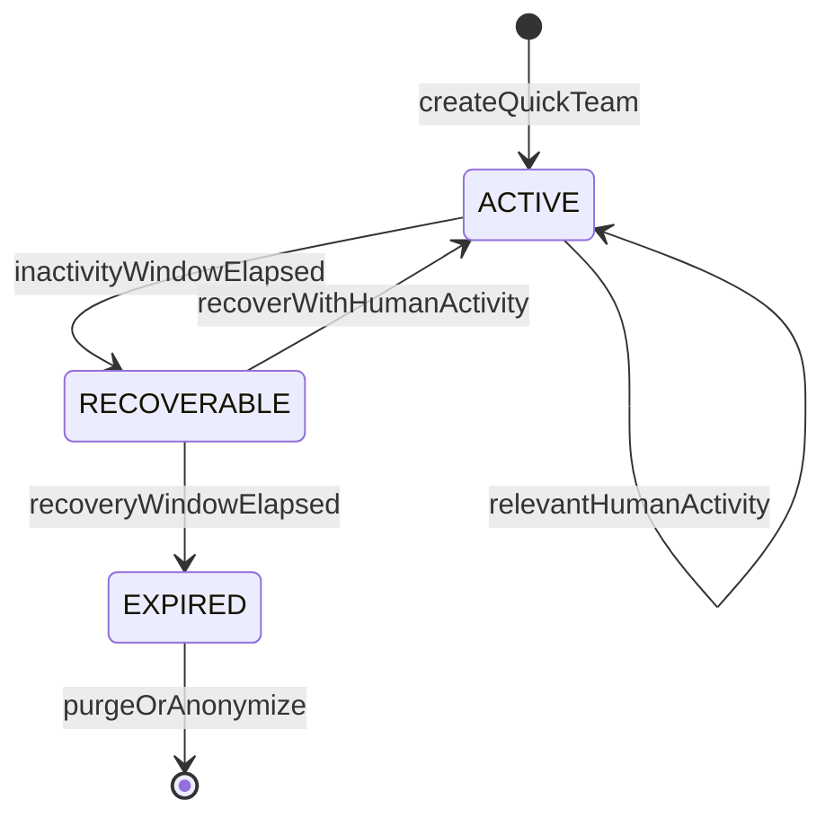
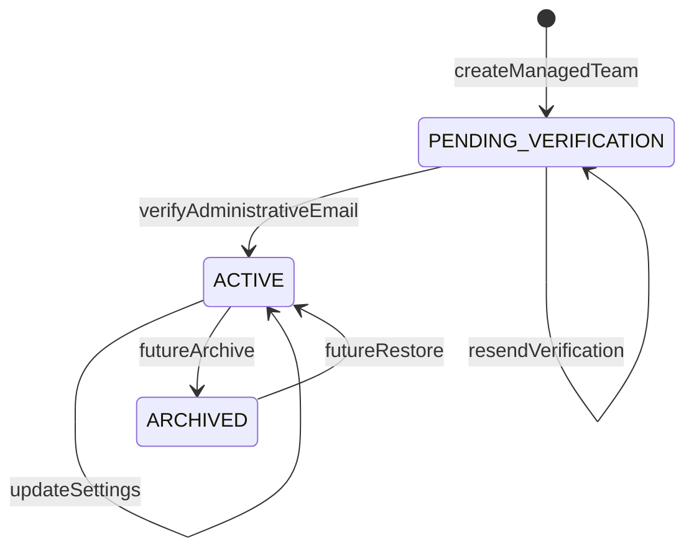
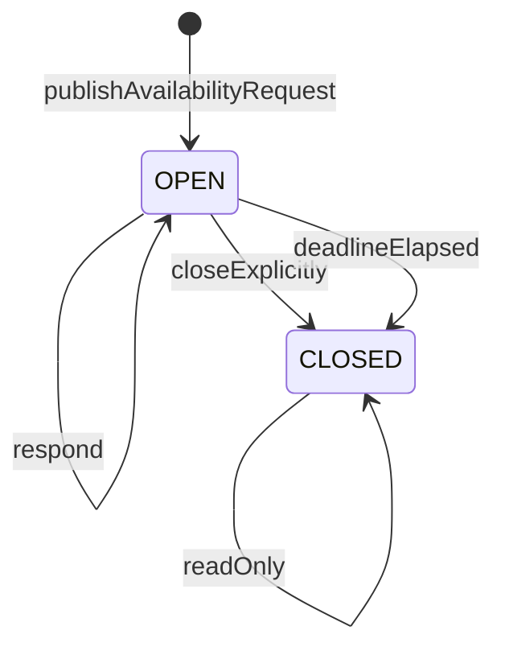
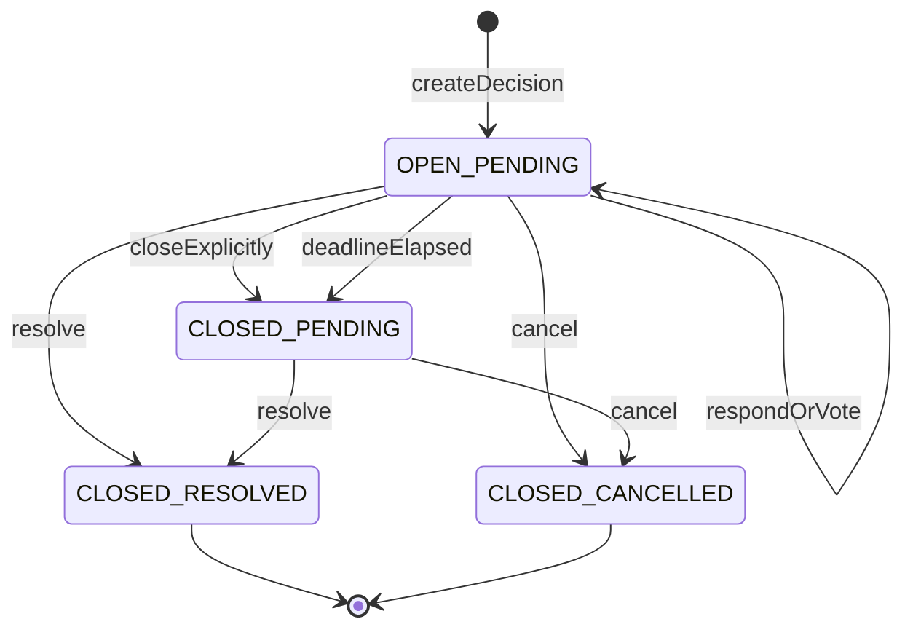

# 14 — State Machines

## 1. Propósito

Este documento formaliza los lifecycles implementables y testeables de Synqo. Cada máquina separa estado de negocio, transición, actor, trigger, precondiciones, autorización, efectos y pruebas recomendadas.

Referencias principales: `product/08-lifecycles.md`, `product/07-business-rules.md`, `technical-design/13-domain/domain-design.md` y `product/19-open-questions.md`.

## 2. Convenciones

- `System job`: proceso interno programado con pg-boss según `technical-design/20-jobs-events/jobs-and-events.md`.
- `Participant`: participante activo del equipo.
- `Administrator`: identidad administrativa verificada del equipo administrable.
- `Application`: capa de aplicación que orquesta transacción, autorización y persistencia.
- Una transición marcada como idempotente puede repetirse sin crear cambios duplicados.
- Las visitas pasivas, previews, bots, jobs y automatismos no cuentan como actividad relevante de equipo rápido.

## 3. Equipo rápido

### Estados

| Estado | Descripción |
|---|---|
| `ACTIVE` | Equipo rápido usable y renovable por actividad humana relevante. |
| `RECOVERABLE` | Equipo temporalmente fuera de vigencia normal, aún recuperable por interacción humana válida. |
| `EXPIRED` | Estado terminal de negocio: no recuperable; datos de dominio y credenciales se eliminan o anonimizan irreversiblemente. |

### Diagrama



### Transiciones

| ID | Origen | Destino | Trigger | Actor | Autorización | Precondiciones | Efectos / jobs | Errores | Tests recomendados |
|---|---|---|---|---|---|---|---|---|---|
| `SM-QT-01` | none | `ACTIVE` | Crear equipo rápido | Application | Ninguna cuenta requerida; creador inicia participante local. | Zona horaria IANA válida; modalidad `QUICK`. | Crear equipo, participante inicial, acceso inicial y `lastRelevantActivityAt`. | Zona horaria inválida; modalidad no soportada. | Crear rápido sin cuenta; crea participante; tres estados habilitados. |
| `SM-QT-02` | `ACTIVE` | `ACTIVE` | Actividad humana relevante | Participant / Application | Sesión/enlace válido para equipo. | Acción incluida en `BR-ACT-02`; no bot/preview/job. | Actualizar `lastRelevantActivityAt`; mantener `ACTIVE`. | Acceso inválido; actividad no relevante. | Actividad válida renueva; visita pasiva no renueva. |
| `SM-QT-03` | `ACTIVE` | `RECOVERABLE` | 30 días sin actividad relevante | System job | Job interno. | `now >= lastRelevantActivityAt + 30d`; equipo sigue `ACTIVE`. | Cambiar estado; registrar auditoría mínima; no enviar notificación externa automática. | Equipo ya cambiado; reloj/estado inconsistente. | Job mueve solo equipos vencidos; no mueve si hubo actividad reciente. |
| `SM-QT-04` | `RECOVERABLE` | `ACTIVE` | Reactivación por interacción humana válida | Participant / Application | Acceso válido y aún recuperable. | `now < recoverableSince + 14d`; acción humana válida. | Cambiar a `ACTIVE`; actualizar `lastRelevantActivityAt`. | Equipo expirado; acción pasiva; acceso inválido. | Reactivación dentro de ventana; bot no reactiva. |
| `SM-QT-05` | `RECOVERABLE` | `EXPIRED` | 14 días sin reactivación válida | System job | Job interno. | `now >= recoverableSince + 14d`. | Cambiar a `EXPIRED`; invalidar credenciales; lanzar eliminación/anonimización irreversible. | Equipo ya activo/expirado; fallo de limpieza. | Expira tras 14 días; invalidación de enlaces; idempotencia del job. |
| `SM-QT-06` | `EXPIRED` | `EXPIRED` | Acceso posterior | Participant / Application | Ninguna capacidad recuperable. | Equipo terminal. | Denegar operación y mostrar estado no recuperable si procede. | `TEAM_EXPIRED`. | Enlace antiguo no abre acciones ni reactiva. |
| `SM-QT-07` | `ACTIVE`/`RECOVERABLE` | mismo estado | Vincular equipo/participación a cuenta | Participant / Account | Prueba suficiente de control. | Equipo no `EXPIRED`. | Crear vínculo sin alterar modalidad ni lifecycle. | Prueba insuficiente; equipo expirado. | Vinculación no cambia `ACTIVE/RECOVERABLE` ni plazos. |

## 4. Equipo administrable

### Estados

| Estado | Descripción |
|---|---|
| `PENDING_VERIFICATION` | Equipo creado con email administrativo pendiente; no otorga administración persistente. |
| `ACTIVE` | Administración verificada; equipo persistente y configurable. |
| `ARCHIVED` | Estado futuro, fuera del MVP salvo diseño de evolución. |

### Diagrama



### Transiciones

| ID | Origen | Destino | Trigger | Actor | Autorización | Precondiciones | Efectos / jobs | Errores | Tests recomendados |
|---|---|---|---|---|---|---|---|---|---|
| `SM-MT-01` | none | `PENDING_VERIFICATION` | Crear equipo administrable | Application | Ninguna cuenta requerida; requiere email admin. | Email válido; zona horaria IANA válida; modalidad `MANAGED`. | Crear equipo, identidad administrativa pendiente, token de verificación; enviar email transaccional. | Email inválido; zona horaria inválida. | Crea equipo sin cuenta; no concede admin persistente. |
| `SM-MT-02` | `PENDING_VERIFICATION` | `ACTIVE` | Verificar email administrativo | Administrator / Application | Token de verificación válido. | Token no usado/no expirado; identidad admin primaria disponible. | Activar equipo; conceder administración primaria; aplicar defaults de políticas y estados; invalidar token. | Token inválido/expirado/usado. | Verificación activa equipo; token no es reusable. |
| `SM-MT-03` | `PENDING_VERIFICATION` | `PENDING_VERIFICATION` | Reenviar verificación | Application | Control del canal definido por Identity & Access. | Equipo pendiente; política antispam futura. | Emitir nuevo token y enviar email transaccional; invalidar token anterior si procede. | Equipo activo; límite de reenvíos. | Nuevo token reemplaza anterior; no activa equipo. |
| `SM-MT-04` | `ACTIVE` | `ACTIVE` | Cambiar configuración/políticas | Administrator | Admin verificado del equipo. | Estados habilitados válidos; políticas `EVERYONE`/`ADMINISTRATORS`. | Persistir configuración y auditoría mínima. | No autorizado; configuración inválida. | No permite deshabilitar `AVAILABLE` y `UNAVAILABLE` simultáneamente. |
| `SM-MT-05` | `ACTIVE` | `ARCHIVED` | Archivar equipo | Administrator | Futuro, fuera de MVP. | Decisión futura explícita. | No implementar en MVP. | `FEATURE_NOT_IN_MVP`. | Test pendiente solo como exclusión. |
| `SM-MT-06` | `ARCHIVED` | `ACTIVE` | Restaurar equipo | Administrator | Futuro, fuera de MVP. | Decisión futura explícita. | No implementar en MVP. | `FEATURE_NOT_IN_MVP`. | Test pendiente solo como exclusión. |

La inactividad ordinaria no cambia el estado de un equipo administrable.

## 5. Solicitud de disponibilidad

### Estados

| Estado | Descripción |
|---|---|
| `OPEN` | Acepta respuestas y actualiza disponibilidad general. |
| `CLOSED` | Ya no acepta respuestas salvo reapertura futura explícitamente soportada. |

`Draft` puede existir como estado de interfaz, pero no se requiere persistencia de dominio en MVP.

### Diagrama



### Transiciones

| ID | Origen | Destino | Trigger | Actor | Autorización | Precondiciones | Efectos / jobs | Errores | Tests recomendados |
|---|---|---|---|---|---|---|---|---|---|
| `SM-AR-01` | none | `OPEN` | Crear/publicar solicitud | Participant / Administrator | Según política de creación del equipo. | Equipo activo; intervalo inicio/fin válido; destinatarios = participantes activos. | Crear solicitud; programar cierre por deadline si existe; no enviar notificación externa automática. | No autorizado; intervalo inválido; equipo expirado. | Solicitud requiere intervalo; respeta política; no crea destinatarios parciales. |
| `SM-AR-02` | `OPEN` | `OPEN` | Responder solicitud | Participant | Participante activo destinatario. | Fecha(s) dentro del intervalo; estados habilitados; solicitud abierta. | Actualizar disponibilidad general; registrar actividad relevante si equipo rápido. | Solicitud cerrada; estado no habilitado; participante inactivo. | Respuesta actualiza disponibilidad general; idempotencia de reintento. |
| `SM-AR-03` | `OPEN` | `CLOSED` | Cierre explícito | Creador autorizado / Administrator | Según política futura de cierre; mínimo creador o admin donde aplique. | Solicitud abierta. | Cerrar; impedir nuevas respuestas; auditoría mínima. | No autorizado; ya cerrada. | Cerrada rechaza respuestas; transición idempotente. |
| `SM-AR-04` | `OPEN` | `CLOSED` | Deadline alcanzado | System job | Job interno. | Deadline definido y vencido. | Cerrar; auditoría mínima; no enviar notificación externa automática. | Ya cerrada; deadline ausente. | Job cierra vencidas; no cierra sin deadline. |
| `SM-AR-05` | `CLOSED` | `CLOSED` | Intento de responder | Participant | No aplica. | Solicitud cerrada. | Denegar sin modificar disponibilidad. | `REQUEST_CLOSED`. | Responder cerrada no muta disponibilidad. |

## 6. Consulta

La consulta tiene dos ejes de estado:

```text
participationState: OPEN | CLOSED
resolutionState:    PENDING | RESOLVED | CANCELLED
```

### Combinaciones válidas

| Participación | Resolución | Estado lógico | Significado |
|---|---|---|---|
| `OPEN` | `PENDING` | `OPEN_PENDING` | Acepta respuestas/votos. |
| `CLOSED` | `PENDING` | `CLOSED_PENDING` | Ya no acepta respuestas; todavía no hay decisión final. |
| `CLOSED` | `RESOLVED` | `CLOSED_RESOLVED` | Decisión final explícita registrada. |
| `CLOSED` | `CANCELLED` | `CLOSED_CANCELLED` | Consulta cancelada, conservando histórico. |

Combinaciones inválidas: `OPEN/RESOLVED`, `OPEN/CANCELLED`. Resolver o cancelar fuerza `participationState = CLOSED`.

### Diagrama



### Transiciones comunes

| ID | Origen | Destino | Trigger | Actor | Autorización | Precondiciones | Efectos / jobs | Errores | Tests recomendados |
|---|---|---|---|---|---|---|---|---|---|
| `SM-DC-01` | none | `OPEN/PENDING` | Crear propuesta o encuesta | Participant / Administrator | Según política de creación del equipo. | Equipo activo; opciones suficientes; tipo `PROPOSAL` o `SURVEY`; destinatarios activos. | Crear consulta, opciones y estado inicial; programar deadline si existe; actividad relevante si equipo rápido. | No autorizado; opciones inválidas; equipo expirado. | Crea solo tipos MVP; no destinatarios parciales. |
| `SM-DC-02` | `OPEN/PENDING` | `OPEN/PENDING` | Responder/votar | Participant | Participante activo del equipo; acceso válido. | Consulta abierta; respuesta válida para tipo; estados/opciones permitidos. | Crear o reemplazar respuesta de forma idempotente; recalcular resultado derivado o invalidar cache; actividad relevante. | Consulta cerrada; participante inactivo; respuesta inválida. | Reintento no duplica; modificación permitida abierta. |
| `SM-DC-03` | `OPEN/PENDING` | `CLOSED/PENDING` | Cierre explícito | Creador autorizado / Administrator | Según `technical-design/15-authorization/authorization-matrix.md`; debe validarse server-side. | Consulta abierta. | Cerrar participación; conservar resultado calculable; no resolver. | No autorizado; ya cerrada. | Cierre no crea resolución; nuevas respuestas rechazadas. |
| `SM-DC-04` | `OPEN/PENDING` | `CLOSED/PENDING` | Deadline alcanzado | System job | Job interno. | Deadline definido y vencido; consulta abierta. | Cerrar participación; no resolver; no enviar notificación externa automática. | Ya cerrada; deadline ausente. | Deadline deja `PENDING`; no elige ganador. |
| `SM-DC-05` | `OPEN/PENDING` | `CLOSED/RESOLVED` | Resolver desde abierta | Participant / Administrator | Según modalidad: rápido todos; administrable por política. | Resolución válida para tipo; permisos OK. | Cerrar participación; registrar resolución; snapshot/contexto mínimo; actividad relevante. | No autorizado; resolución inválida; conflicto concurrente. | Resolver abierta cierra; dos resoluciones concurrentes solo una gana. |
| `SM-DC-06` | `CLOSED/PENDING` | `CLOSED/RESOLVED` | Resolver tras cierre | Participant / Administrator | Según modalidad/política. | Resolución válida para tipo; aún `PENDING`. | Registrar resolución; snapshot/contexto mínimo. | No autorizado; ya resuelta/cancelada. | Puede resolver tras deadline; no acepta respuesta previa. |
| `SM-DC-07` | `OPEN/PENDING` | `CLOSED/CANCELLED` | Cancelar desde abierta | Creador autorizado / Administrator | Según `technical-design/15-authorization/authorization-matrix.md`. | Consulta abierta y pendiente. | Cerrar participación; registrar cancelación; actividad relevante. | No autorizado; ya cerrada/resuelta. | Cancelar abierta cierra; rechaza respuestas posteriores. |
| `SM-DC-08` | `CLOSED/PENDING` | `CLOSED/CANCELLED` | Cancelar tras cierre | Creador autorizado / Administrator | Según `technical-design/15-authorization/authorization-matrix.md`. | Consulta cerrada y pendiente. | Registrar cancelación; conservar histórico. | No autorizado; ya resuelta/cancelada. | Cancelación tras deadline no borra respuestas. |
| `SM-DC-09` | `CLOSED/RESOLVED` | `CLOSED/RESOLVED` | Intento de responder/resolver/cancelar | Any | No aplica salvo lectura. | Estado terminal. | Denegar mutación; conservar histórico. | `DECISION_ALREADY_RESOLVED`. | Terminal resuelta es inmutable. |
| `SM-DC-10` | `CLOSED/CANCELLED` | `CLOSED/CANCELLED` | Intento de responder/resolver | Any | No aplica salvo lectura. | Estado terminal. | Denegar mutación; conservar histórico. | `DECISION_CANCELLED`. | Terminal cancelada es inmutable. |

### Reglas específicas de propuesta

| ID | Regla | Estado afectado | Tests recomendados |
|---|---|---|---|
| `SM-PRO-01` | Crear propuesta exige al menos dos opciones temporales. | `SM-DC-01` | Cero/una opción fallan; dos opciones pasan. |
| `SM-PRO-02` | Cada opción tiene fecha obligatoria, hora opcional y nunca franja horaria. | `SM-DC-01` | Rechazar opción sin fecha o con intervalo. |
| `SM-PRO-03` | Respuesta por opción usa estados habilitados del equipo. | `SM-DC-02` | Estado deshabilitado falla en administrable. |
| `SM-PRO-04` | Respuesta de propuesta no modifica disponibilidad general. | `SM-DC-02` | Cambiar respuesta no altera `AvailabilityEntry`. |
| `SM-PRO-05` | Resolución de propuesta selecciona exactamente una opción temporal. | `SM-DC-05`, `SM-DC-06` | Ninguna o múltiples opciones fallan. |

### Reglas específicas de encuesta

| ID | Regla | Estado afectado | Tests recomendados |
|---|---|---|---|
| `SM-SUR-01` | Crear encuesta exige modalidad `SINGLE` o `MULTIPLE`. | `SM-DC-01` | Modalidad desconocida falla. |
| `SM-SUR-02` | `SINGLE` permite como máximo una selección por participante. | `SM-DC-02` | Dos selecciones en single fallan. |
| `SM-SUR-03` | `MULTIPLE` permite varias selecciones. | `SM-DC-02` | Varias selecciones se guardan. |
| `SM-SUR-04` | Modalidad no cambia tras existir votos. | Edición futura | Intento de cambio con votos falla. |
| `SM-SUR-05` | Resolución `SINGLE` contiene una opción; `MULTIPLE`, una o varias. | `SM-DC-05`, `SM-DC-06` | Resolución incompatible con modalidad falla. |
| `SM-SUR-06` | Empate no produce desempate automático. | Resultado | Resultado empatado queda sin resolución automática. |

## 7. Errores de dominio recomendados

| Código | Uso |
|---|---|
| `TEAM_EXPIRED` | Operación sobre equipo rápido expirado definitivamente. |
| `TEAM_RECOVERABLE_REQUIRES_HUMAN_ACTIVITY` | Intento pasivo/automático de reactivar. |
| `ADMIN_VERIFICATION_REQUIRED` | Administración persistente antes de verificar email. |
| `FORBIDDEN_BY_TEAM_POLICY` | Actor sin permiso contextual. |
| `INVALID_STATE_TRANSITION` | Transición no permitida por estado origen/destino. |
| `REQUEST_CLOSED` | Respuesta a solicitud cerrada. |
| `DECISION_CLOSED` | Respuesta a consulta cerrada. |
| `DECISION_ALREADY_RESOLVED` | Mutación sobre consulta resuelta. |
| `DECISION_CANCELLED` | Mutación sobre consulta cancelada. |
| `INVALID_DECISION_RESPONSE` | Respuesta/voto incompatible con tipo, modalidad u opciones. |
| `INVALID_RESOLUTION` | Resolución incompatible con tipo o modalidad. |
| `CONCURRENT_RESOLUTION_CONFLICT` | Dos intentos compiten por resolver/cancelar. |

## 8. Matriz mínima de tests

| Área | Tests mínimos |
|---|---|
| Equipo rápido | Crear, renovar por actividad válida, no renovar por actividad pasiva, pasar a recoverable, reactivar, expirar, impedir recuperación, vincular sin alterar lifecycle. |
| Equipo administrable | Crear pendiente, verificar, no conceder admin antes de verificación, reenviar token, cambiar configuración válida, rechazar configuración inválida. |
| Solicitud | Crear con intervalo, responder y actualizar disponibilidad, cerrar explícitamente, cerrar por deadline, rechazar respuesta cerrada. |
| Consulta | Crear propuesta/encuesta, responder abierta, modificar respuesta abierta, cerrar por deadline sin resolver, resolver desde abierta/cerrada, cancelar desde abierta/cerrada, rechazar mutaciones terminales. |
| Concurrencia | Resolver dos veces en paralelo; cancelar vs resolver en paralelo; doble submit de respuesta. |
| Seguridad | Cada transición sensible valida autorización server-side; acceso de otro equipo falla. |
| Exclusiones MVP | No notificaciones automáticas de actividad; no franjas; no recurrencia; no anonimato fuerte; no desempate automático. |

## 9. Cuestiones para fases posteriores

- La matriz exacta de permisos por actor y operación está en `technical-design/15-authorization/authorization-matrix.md`.
- Los mecanismos de sesión, enlaces opacos y revocación están concretados en `technical-design/16-identity-sessions/identity-and-session-design.md`.
- El locking optimista/pesimista para `CONCURRENT_RESOLUTION_CONFLICT` está concretado en `technical-design/17-data-model/data-model.md`.
- Los jobs exactos de deadlines, expiración y limpieza están detallados en `technical-design/20-jobs-events/jobs-and-events.md`.
- El email transaccional permitido para verificación/recuperación está detallado en `technical-design/21-notifications/notification-matrix.md`.
