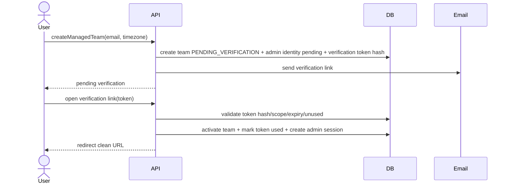
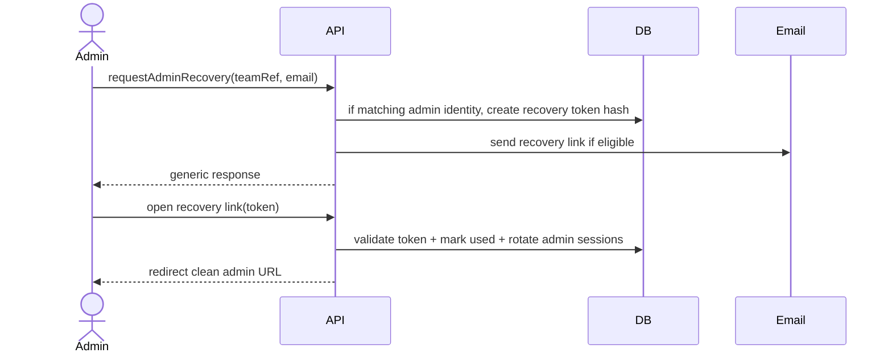
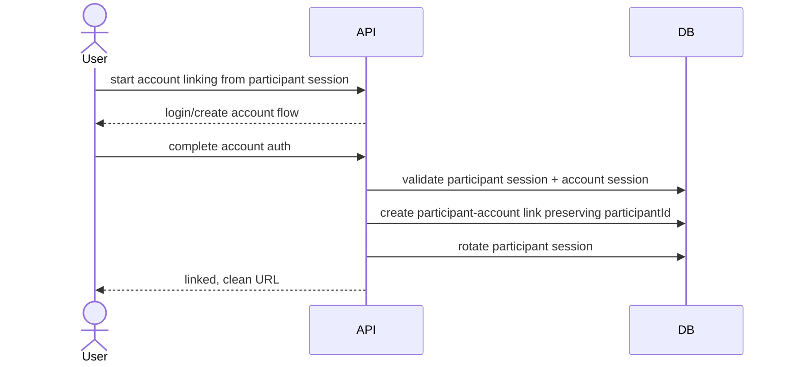
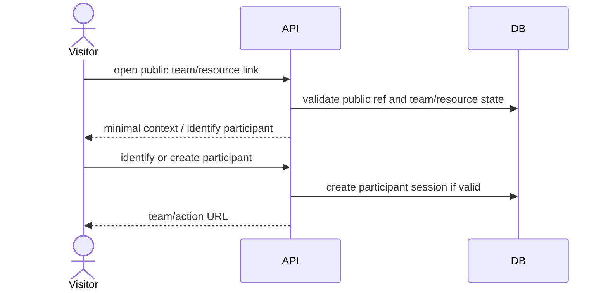

# 16 — Identity and Session Design

## 1. Propósito

Este documento diseña técnicamente cuentas, participant sessions, administrative sessions y enlaces opacos para Synqo. Concilia ADR-008, ADR-021, ADR-015 y la matriz de autorización de fase 15.

No implementa código ni define todavía tablas finales; el esquema físico se concretará en fase 17.

## 2. Principios

- `Cuenta`, `Participante` y `Administrador` no se colapsan.
- Las capacidades esenciales funcionan sin cuenta.
- Ninguna capacidad administrativa depende de un bearer link permanente.
- Todo enlace sensible se canjea por sesión contextual y redirige a URL limpia.
- Los tokens sensibles persistidos se almacenan por hash cuando proceda.
- Las sesiones son opacas, server-side y revocables.
- Vincular participante a cuenta conserva `participantId`, autoría e histórico.
- La autorización final la decide fase 15; identidad solo aporta contexto verificable.

## 3. Identidades y credenciales

| Elemento | Identifica | Alcance | Uso principal | Persistencia recomendada |
|---|---|---|---|---|
| `AccountSession` | Cuenta global | Global | Inicio autenticado, equipos vinculados, pendientes agregados. | Session opaca server-side. |
| `ParticipantSession` | Participante local | `teamId + participantId` | Disponibilidad, respuestas, votos, acciones de participante. | Session opaca server-side. |
| `AdministrativeSession` | Identidad administrativa | `teamId + administrativeIdentityId` | Configuración, políticas, recuperación/admin. | Session opaca server-side. |
| `PublicLink` | Ninguna identidad | Equipo o acción pública acotada | Entrada de baja fricción e identificación posterior. | Token opaco o slug público no privilegiado. |
| `IdentifiedLink` | Participante local | `teamId + participantId + target` | Deep link que establece participant session. | Token opaco hasheado, scope mínimo. |
| `VerificationLink` | Email/admin/cuenta pendiente | Acción concreta | Verificar equipo administrable o cuenta. | Token opaco hasheado, one-time. |
| `RecoveryLink` | Admin/cuenta recuperable | Acción concreta | Recuperar administración o cuenta. | Token opaco hasheado, one-time. |

## 4. Cookies y almacenamiento cliente

### Web/PWA

| Cookie | Contenido | Atributos | Notas |
|---|---|---|---|
| `synqo_account_session` | ID opaco de `AccountSession` | `HttpOnly`, `Secure`, `SameSite=Lax`, `Path=/`, TTL deslizante | No contiene datos de cuenta. |
| `synqo_context_session` | ID opaco de la sesión contextual activa o selector de sesión | `HttpOnly`, `Secure`, `SameSite=Lax`, `Path=/`, TTL deslizante | Puede representar participant/admin actual o apuntar a registro server-side de contexto activo. |
| `synqo_csrf` | Token CSRF no secreto | `Secure`, `SameSite=Lax`, no `HttpOnly` si double-submit | Solo para requests mutantes con cookie. |

Para evitar cookies por equipo ilimitadas, se recomienda un registro server-side de sesiones contextuales y una cookie opaca de contexto actual. El servidor puede listar contextos activos para la cuenta/sesión y activar uno al abrir un equipo.

### Capacitor futuro

Queda fuera del MVP web inicial. Si se implementa, usará token opaco Bearer almacenado en almacenamiento seguro del dispositivo y la misma autorización server-side.

## 5. Emisión, TTL, rotación y revocación

Los valores son defaults técnicos iniciales; pueden ajustarse en fase de implementación con threat model y UX.

| Tipo | Emisión | Almacenamiento servidor | TTL recomendado | Rotación | Revocación | One-time | Clean redirect |
|---|---|---|---|---|---|---|---|
| `AccountSession` | Tras passwordless/OIDC compatible. | Token aleatorio hasheado o session id opaco con secreto server-side. | 30 días deslizante; absoluto 90 días. | Rotar al login y al elevar contexto sensible. | Logout, cambio de credenciales, sospecha. | No | No aplica. |
| `ParticipantSession` | Al identificarse, canjear link identificado o crear participante. | Session opaca asociada a `teamId + participantId`. | 30 días deslizante; limitado por expiración del equipo rápido. | Rotar al canjear link y al vincular cuenta. | Salir del equipo, expiración de equipo, revocación manual futura. | No | Sí si nace de URL tokenizada. |
| `AdministrativeSession` | Tras verificación/recovery admin. | Session opaca asociada a `teamId + administrativeIdentityId`. | 12 horas deslizante; absoluto 7 días. | Rotar al verificar/recover y al vincular cuenta. | Logout admin, recovery nuevo, cambio de email futuro. | No | Sí. |
| `PublicLink` | Crear/compartir equipo o recurso. | Identificador público no secreto o token opaco de bajo privilegio. | Mientras equipo/recurso sea accesible; rápido limitado por lifecycle. | Regeneración manual futura. | Revocable cuando el modelo lo permita. | No | No necesario si no contiene secreto privilegiado. |
| `IdentifiedLink` | Crear enlace personalizado para participante/acción. | Hash de token + scope + expiry + revocation. | 7 días por defecto; máximo 30 días si UX lo exige. | Nuevo link invalida anterior opcionalmente. | Revocable por participante/admin según matriz. | Recomendado no one-time para deep links reutilizables acotados; sí one-time para acciones sensibles. | Sí, siempre. |
| `VerificationLink` | Crear equipo administrable/cuenta. | Hash de token + email + scope. | 30 minutos a 24 horas según caso; admin inicial 24h. | Reenviar invalida token anterior. | Verificación exitosa, reenvío, expiración. | Sí | Sí, siempre. |
| `RecoveryLink` | Solicitud de recuperación. | Hash de token + target + risk metadata. | 30 minutos. | Nuevo recovery invalida anteriores. | Uso exitoso, expiración, nuevo recovery. | Sí | Sí, siempre. |

## 6. Hashing y formato de tokens

- Tokens privilegiados: al menos 128 bits de entropía, preferiblemente 192/256 bits.
- Formato externo: string URL-safe aleatorio, sin datos codificados.
- Persistencia: guardar hash con algoritmo resistente para tokens largos aleatorios, por ejemplo HMAC-SHA-256 con secreto servidor o SHA-256 + pepper; no guardar token claro.
- Comparación: constant-time cuando aplique.
- Metadata persistida: `scope`, `teamId`, `participantId/adminId/accountId` si aplica, `target`, `expiresAt`, `usedAt`, `revokedAt`, `createdBy`, `lastExchangedAt`.
- Logs/telemetría: nunca registrar token claro; redacción automática de query params sensibles.

## 7. Clean redirect

Flujo obligatorio para enlaces con token sensible:

1. Usuario abre URL con token opaco.
2. Servidor valida hash, scope, expiración, revocación, estado del recurso y anti-abuso.
3. Servidor crea o rota sesión contextual.
4. Si el token es one-time, marca `usedAt` en la misma transacción.
5. Servidor responde con redirect a URL limpia sin token.
6. La pantalla final carga usando cookie/sesión contextual.

La URL limpia debe conservar solo ruta y parámetros no sensibles, por ejemplo `/teams/{publicTeamRef}/decisions/{publicDecisionRef}`.

## 8. Convivencia de sesiones y equipos

Una persona puede tener simultáneamente:

- account session global;
- participant sessions de varios equipos;
- administrative sessions de uno o varios equipos administrables;
- participant y admin session del mismo equipo si también participa.

Reglas:

- La cuenta global agrega y facilita navegación, pero no sustituye participant/admin sessions.
- Cada request contextual debe declarar o derivar `teamId` desde la ruta/recurso.
- Si hay varias sesiones válidas para un equipo, el servidor construye `ActorContext` con capacidades acumulables solo cuando estén verificadas y separadas: participante para acciones propias; admin para settings/resolución si corresponde.
- Un admin no puede responder disponibilidad/votos como participante salvo que exista también participant session.
- Un participante con cuenta conserva el mismo `participantId`.
- Un equipo rápido vinculado a cuenta mantiene su expiración.

## 9. Vinculación participante ↔ cuenta

### Objetivo

Asociar una participación local existente a una cuenta global sin recrear identidad, autoría ni histórico.

### Precondiciones

- Participant session válida para `teamId + participantId`.
- Account session válida o flujo de creación/login completado.
- Participante no vinculado a otra cuenta incompatible.
- No se usa coincidencia de nombre como prueba.

### Transacción

1. Bloquear/leer participante.
2. Validar control de participant session.
3. Validar account session.
4. Crear vínculo `participantId -> accountId`.
5. Rotar participant session.
6. Auditar vínculo sin exponer PII innecesaria.

### Efectos

- `participantId` no cambia.
- Disponibilidad, respuestas, votos, resoluciones creadas e histórico conservan autoría local.
- La cuenta puede mostrar pendientes/histórico agregados según autorización.
- Vincular equipo rápido a cuenta no altera `ACTIVE/RECOVERABLE/EXPIRED`.

## 10. Flujos técnicos

### Crear equipo administrable + verificar



Reglas:

- Conocer enlace público del equipo no verifica administración.
- Reenviar verificación invalida token anterior cuando sea posible.
- La sesión administrativa resultante es contextual al equipo.

### Recuperar administración



Reglas:

- La respuesta de solicitud debe ser genérica para evitar enumeración de emails/equipos.
- Nuevo recovery invalida tokens anteriores del mismo alcance.
- Puede revocar administrative sessions previas para reducir riesgo.

### Enlace identificado

```mermaid
sequenceDiagram
    actor Participant
    participant API
    participant DB

    Participant->>API: open identified link(token)
    API->>DB: validate token hash/scope/team/participant/expiry/revocation
    API->>DB: create or rotate participant session
    API-->>Participant: redirect clean target URL
    Participant->>API: load target with session cookie
```

Reglas:

- El link establece identidad local, no cuenta global.
- Debe fallar si el equipo rápido está `EXPIRED`.
- Previews/crawlers no deben renovar actividad relevante; la actividad se registra al ejecutar una acción humana posterior.

### Vincular cuenta



Reglas:

- No se vincula por nombre.
- Si el participante ya está vinculado a otra cuenta, requiere flujo explícito futuro; por defecto denegar.
- La vinculación no convierte equipo rápido en administrable.

### Enlace público



Reglas:

- El link público no concede administración ni identidad de participante.
- La información inicial debe ser mínima y no nominal sensible.

## 11. Controles contra ataques

| Riesgo | Control |
|---|---|
| Session fixation | Rotar sesión tras login, verificación admin, canje de link identificado y vinculación de cuenta. |
| Replay de token one-time | `usedAt` transaccional, unique constraint por token hash, rechazo tras uso. |
| Reutilización de link revocado | `revokedAt` y scope check en cada canje. |
| Token leakage en URL | Clean redirect obligatorio; redacción en logs; no enviar tokens a analytics; `Referrer-Policy` restrictiva. |
| Enumeración | Respuestas genéricas en recovery/login; public refs no secuenciales; rate limiting. |
| IDOR | Validación `teamId`/scope/recurso según fase 15. |
| CSRF | Cookies `SameSite`, CSRF token para mutaciones, Origin/Referer check donde proceda. |
| XSS roba tokens | Tokens de sesión en cookies `HttpOnly`; CSP/Helmet; tokens URL se limpian. |
| Crawlers/previews | No contar GET/canje pasivo como actividad relevante; no consumir acciones destructivas por GET. |
| Admin por bearer permanente | Links admin one-time o corto TTL; capacidad real en `AdministrativeSession` revocable. |

## 12. Revocación y expiración

- Expirar equipo rápido invalida participant/admin/access sessions y links asociados al equipo.
- Purgar/anonimizar rápido elimina o anonimiza credenciales de dominio según fase 20/23.
- Logout cuenta revoca `AccountSession`, pero no necesariamente participant sessions sin cuenta salvo acción explícita del usuario.
- Logout contextual revoca participant/admin session activa.
- Nuevo recovery admin puede revocar administrative sessions anteriores.
- Reenvío de verification link invalida tokens pendientes anteriores del mismo propósito.

## 13. Datos mínimos para fase 17

La fase de datos deberá concretar tablas equivalentes a:

- `account_sessions`
- `participant_sessions`
- `administrative_sessions`
- `access_credentials`
- `participant_account_links`
- `administrative_account_links`

Campos mínimos transversales:

- `id`
- `tokenHash` o session id opaco
- `scope`
- `teamId`
- `participantId` / `administrativeIdentityId` / `accountId` cuando aplique
- `targetType`, `targetId`, `targetPath`
- `createdAt`, `expiresAt`, `lastUsedAt`, `usedAt`, `revokedAt`
- `createdByActor`
- `userAgentHash` / `ipPrefix` opcional y minimizado para anti-abuso

## 14. Decisiones fuera de alcance

- JWT como mecanismo principal.
- Cuenta obligatoria para participar.
- Bearer link administrativo permanente.
- Conversión de equipo rápido a administrable.
- Multiples administradores equivalentes en MVP.
- Notificaciones externas automáticas de actividad.
