# 17 — ERD

Este ERD resume el modelo lógico definido en `technical-design/17-data-model/data-model.md`. Los checks condicionales de negocio siguen documentados allí y se refuerzan en dominio/transacciones cuando dependen de varias tablas.

```mermaid
erDiagram
    TEAMS ||--o{ PARTICIPANTS : contains
    TEAMS ||--o{ ADMINISTRATIVE_IDENTITIES : has
    TEAMS ||--o{ AVAILABILITY_ENTRIES : records
    TEAMS ||--o{ AVAILABILITY_REQUESTS : publishes
    TEAMS ||--o{ DECISION_PROCESSES : owns
    TEAMS ||--o{ ACCESS_CREDENTIALS : scopes

    ACCOUNTS ||--o{ ACCOUNT_SESSIONS : opens
    ACCOUNTS ||--o{ PARTICIPANT_ACCOUNT_LINKS : links
    ACCOUNTS ||--o{ ADMINISTRATIVE_ACCOUNT_LINKS : links

    PARTICIPANTS ||--o{ PARTICIPANT_SESSIONS : opens
    PARTICIPANTS ||--o{ PARTICIPANT_ACCOUNT_LINKS : links
    PARTICIPANTS ||--o{ AVAILABILITY_ENTRIES : declares
    PARTICIPANTS ||--o{ AVAILABILITY_REQUEST_PARTICIPANTS : targeted
    PARTICIPANTS ||--o{ DECISION_RESPONSES : submits

    ADMINISTRATIVE_IDENTITIES ||--o{ ADMINISTRATIVE_SESSIONS : opens
    ADMINISTRATIVE_IDENTITIES ||--o{ ADMINISTRATIVE_ACCOUNT_LINKS : links

    AVAILABILITY_REQUESTS ||--o{ AVAILABILITY_REQUEST_PARTICIPANTS : snapshots
    AVAILABILITY_REQUESTS ||--o{ AVAILABILITY_ENTRIES : updates_source

    DECISION_PROCESSES ||--o| PROPOSAL_DETAILS : proposal
    DECISION_PROCESSES ||--o| SURVEY_DETAILS : survey
    DECISION_PROCESSES ||--|{ DECISION_OPTIONS : offers
    DECISION_PROCESSES ||--o{ DECISION_RESPONSES : receives
    DECISION_PROCESSES ||--o| DECISION_RESOLUTIONS : finalizes

    DECISION_OPTIONS ||--o{ PROPOSAL_RESPONSE_OPTIONS : answered_as
    DECISION_OPTIONS ||--o{ SURVEY_RESPONSE_OPTIONS : selected_as
    DECISION_OPTIONS ||--o{ DECISION_RESOLUTION_OPTIONS : chosen_as

    DECISION_RESPONSES ||--o{ PROPOSAL_RESPONSE_OPTIONS : proposal_values
    DECISION_RESPONSES ||--o{ SURVEY_RESPONSE_OPTIONS : survey_values

    DECISION_RESOLUTIONS ||--|{ DECISION_RESOLUTION_OPTIONS : chooses

    TEAMS ||--o{ DOMAIN_AUDIT_ENTRIES : audits
    TEAMS ||--o{ SCHEDULED_JOBS : schedules

    TEAMS {
        uuid id PK
        text publicRef UK
        text name
        team_mode mode
        text timeZone
        quick_team_state quickState
        managed_team_state managedState
        timestamptz lastRelevantActivityAt
        timestamptz recoverableSince
        timestamptz expiredAt
        team_policy createAvailabilityRequestPolicy
        team_policy createDecisionPolicy
        team_policy resolveDecisionPolicy
        boolean allowAvailable
        boolean allowMaybe
        boolean allowUnavailable
        timestamptz createdAt
        timestamptz updatedAt
        timestamptz deletedAt
    }

    PARTICIPANTS {
        uuid id PK
        uuid teamId FK
        text publicRef
        text displayName
        boolean isActive
        timestamptz joinedAt
        timestamptz deactivatedAt
        timestamptz createdAt
        timestamptz updatedAt
    }

    ACCOUNTS {
        uuid id PK
        citext emailNormalized UK
        timestamptz emailVerifiedAt
        timestamptz disabledAt
        timestamptz createdAt
        timestamptz updatedAt
    }

    PARTICIPANT_ACCOUNT_LINKS {
        uuid id PK
        uuid participantId FK
        uuid accountId FK
        timestamptz linkedAt
        text proofType
    }

    ADMINISTRATIVE_IDENTITIES {
        uuid id PK
        uuid teamId FK
        citext emailNormalized
        boolean isPrimary
        timestamptz verifiedAt
        timestamptz createdAt
        timestamptz updatedAt
    }

    ADMINISTRATIVE_ACCOUNT_LINKS {
        uuid id PK
        uuid administrativeIdentityId FK
        uuid accountId FK
        timestamptz linkedAt
    }

    ACCOUNT_SESSIONS {
        uuid id PK
        uuid accountId FK
        text tokenHash UK
        timestamptz createdAt
        timestamptz expiresAt
        timestamptz lastUsedAt
        timestamptz revokedAt
    }

    PARTICIPANT_SESSIONS {
        uuid id PK
        uuid teamId FK
        uuid participantId FK
        text tokenHash UK
        timestamptz createdAt
        timestamptz expiresAt
        timestamptz lastUsedAt
        timestamptz revokedAt
    }

    ADMINISTRATIVE_SESSIONS {
        uuid id PK
        uuid teamId FK
        uuid administrativeIdentityId FK
        text tokenHash UK
        timestamptz createdAt
        timestamptz expiresAt
        timestamptz lastUsedAt
        timestamptz revokedAt
    }

    ACCESS_CREDENTIALS {
        uuid id PK
        access_credential_type type
        credential_scope scope
        text tokenHash UK
        text publicRef UK
        uuid teamId FK
        uuid participantId FK
        uuid administrativeIdentityId FK
        uuid accountId FK
        text targetType
        uuid targetId
        text targetPath
        boolean oneTime
        timestamptz createdAt
        timestamptz expiresAt
        timestamptz usedAt
        timestamptz revokedAt
    }

    AVAILABILITY_ENTRIES {
        uuid id PK
        uuid teamId FK
        uuid participantId FK
        date localDate
        availability_status status
        uuid sourceRequestId FK
        timestamptz createdAt
        timestamptz updatedAt
    }

    AVAILABILITY_REQUESTS {
        uuid id PK
        uuid teamId FK
        text publicRef
        uuid createdByParticipantId FK
        uuid createdByAdministrativeIdentityId FK
        date startDate
        date endDate
        availability_request_state state
        timestamptz deadlineAt
        timestamptz closedAt
        timestamptz createdAt
        timestamptz updatedAt
    }

    AVAILABILITY_REQUEST_PARTICIPANTS {
        uuid availabilityRequestId PK,FK
        uuid participantId PK,FK
        timestamptz createdAt
    }

    DECISION_PROCESSES {
        uuid id PK
        uuid teamId FK
        text publicRef
        decision_type type
        text title
        text description
        uuid createdByParticipantId FK
        uuid createdByAdministrativeIdentityId FK
        decision_participation_state participationState
        decision_resolution_state resolutionState
        timestamptz deadlineAt
        timestamptz closedAt
        int version
        timestamptz createdAt
        timestamptz updatedAt
        timestamptz deletedAt
    }

    PROPOSAL_DETAILS {
        uuid decisionProcessId PK,FK
        text timeZone
    }

    SURVEY_DETAILS {
        uuid decisionProcessId PK,FK
        survey_mode mode
        survey_visibility visibility
    }

    DECISION_OPTIONS {
        uuid id PK
        uuid decisionProcessId FK
        int position
        text label
        date proposalDate
        time proposalTime
        timestamptz createdAt
        timestamptz updatedAt
        timestamptz deletedAt
    }

    DECISION_RESPONSES {
        uuid id PK
        uuid decisionProcessId FK
        uuid participantId FK
        timestamptz respondedAt
        timestamptz createdAt
        timestamptz updatedAt
    }

    PROPOSAL_RESPONSE_OPTIONS {
        uuid decisionResponseId PK,FK
        uuid decisionOptionId PK,FK
        availability_status status
    }

    SURVEY_RESPONSE_OPTIONS {
        uuid decisionResponseId PK,FK
        uuid decisionOptionId PK,FK
    }

    DECISION_RESOLUTIONS {
        uuid id PK
        uuid decisionProcessId FK,UK
        uuid resolvedByParticipantId FK
        uuid resolvedByAdministrativeIdentityId FK
        text kind
        text reason
        jsonb resultSnapshot
        timestamptz resolvedAt
    }

    DECISION_RESOLUTION_OPTIONS {
        uuid decisionResolutionId PK,FK
        uuid decisionOptionId PK,FK
    }

    SCHEDULED_JOBS {
        uuid id PK
        text type
        uuid teamId FK
        text resourceType
        uuid resourceId
        timestamptz runAt
        text status
        timestamptz createdAt
        timestamptz updatedAt
    }

    DOMAIN_AUDIT_ENTRIES {
        uuid id PK
        uuid teamId FK
        text actorType
        uuid actorId
        text action
        text resourceType
        uuid resourceId
        jsonb metadata
        timestamptz createdAt
    }
```

## Notas de lectura

- `availability_request_participants` es snapshot de destinatarios; las respuestas siguen siendo `availability_entries`.
- `decision_responses` garantiza idempotencia por participante y consulta; las tablas de opciones capturan el contenido por tipo.
- `decision_resolutions` es distinto del resultado calculado; el snapshot es evidencia histórica, no fuente primaria para recalcular.
- `access_credentials` almacena hashes o referencias públicas, nunca tokens claros.
