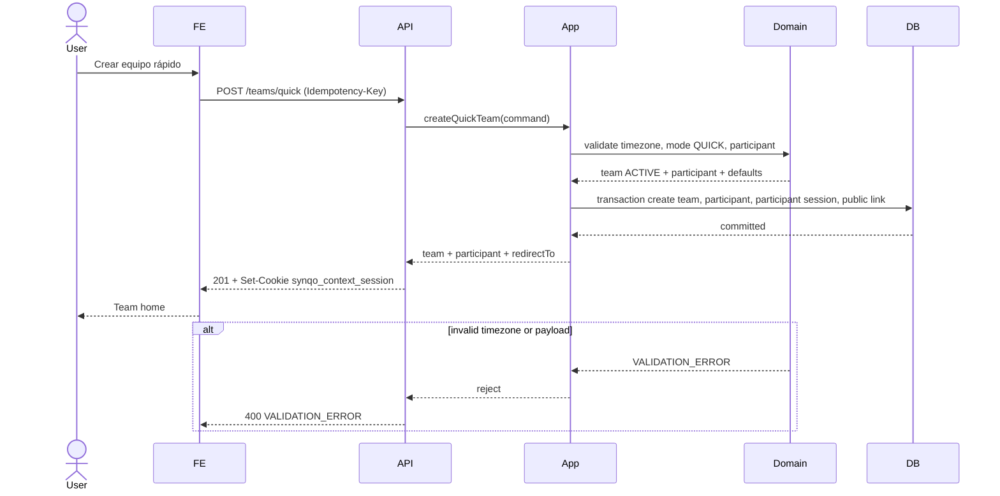
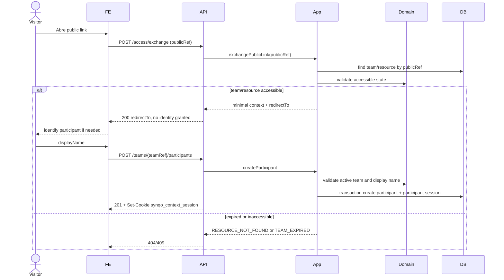
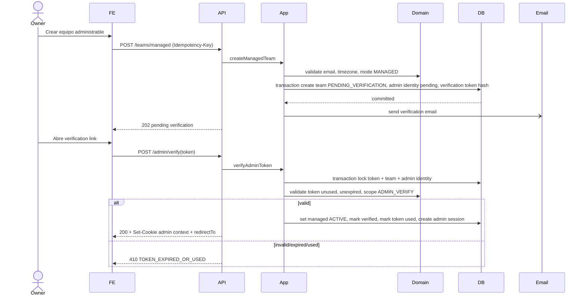
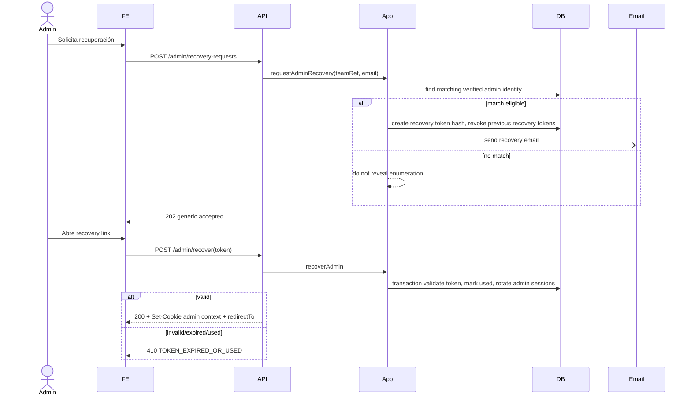
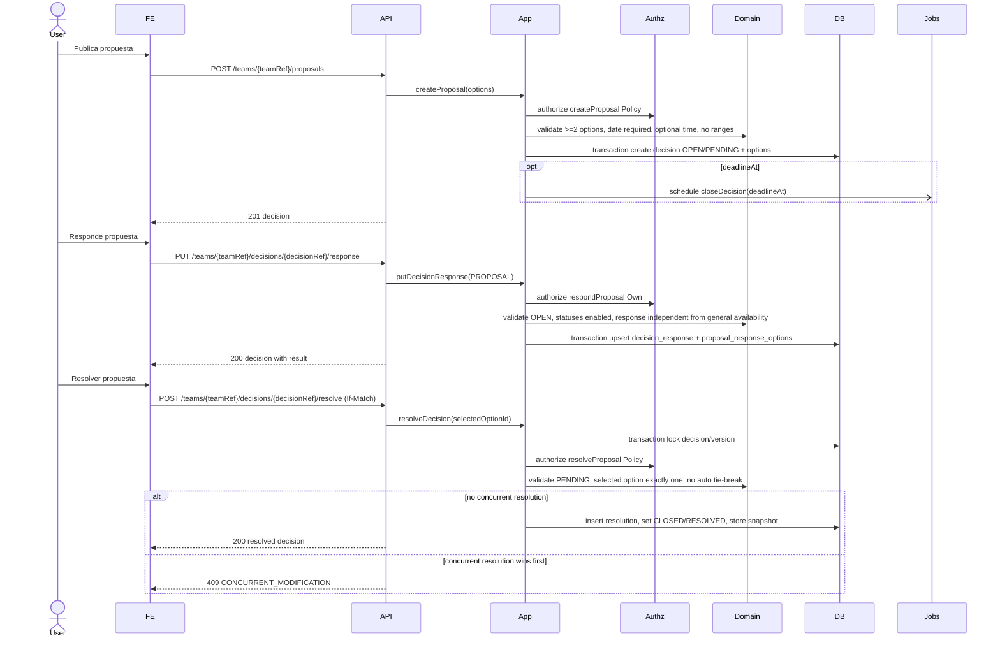
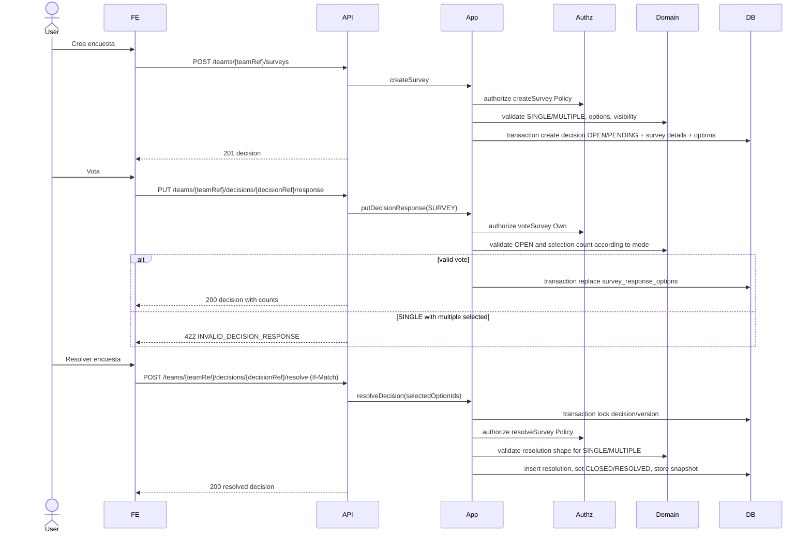
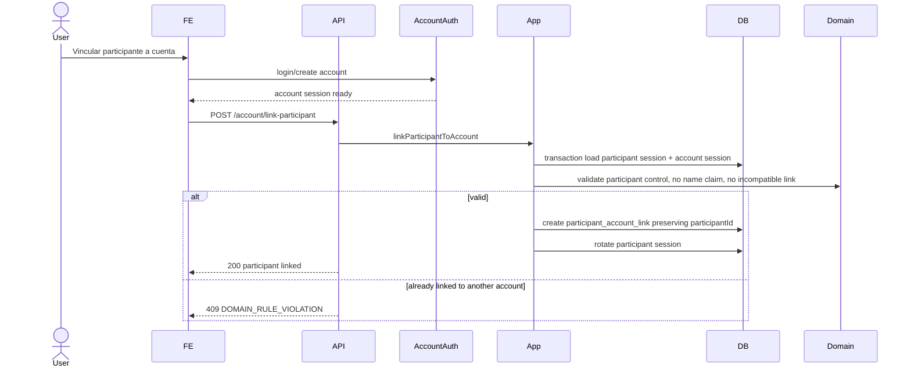
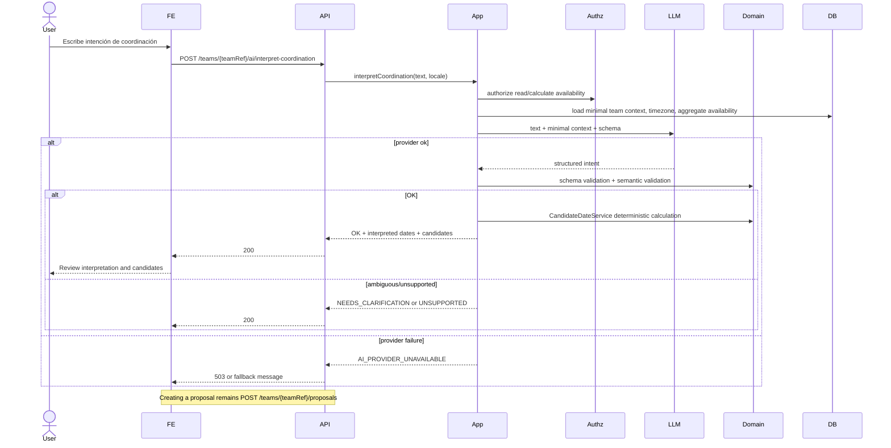
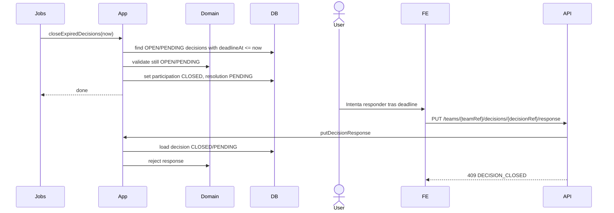

# 19 — Sequence Diagrams

## 1. Propósito

Este documento alinea las interacciones runtime críticas entre frontend, API, servicios de aplicación, dominio, persistencia, jobs y proveedores externos. No describe métodos internos ni implementación de clases; muestra límites transaccionales, autorización, side effects asíncronos y errores relevantes.

Referencias: `product/14-user-flows.md`, `technical-design/16-identity-sessions/identity-and-session-design.md`, `technical-design/18-api/api-design.md`, `technical-design/14-state-machines/state-machines.md`.

## 2. Convenciones

- `FE`: frontend web/PWA.
- `API`: controladores REST.
- `App`: casos de uso de aplicación.
- `Authz`: autorización contextual server-side.
- `Domain`: reglas de dominio deterministas.
- `DB`: PostgreSQL/MikroORM.
- `Jobs`: pg-boss sobre PostgreSQL, concretado en `technical-design/20-jobs-events/jobs-and-events.md`.
- `Email`: proveedor transaccional y plantillas según `technical-design/21-notifications/notification-matrix.md`.
- Side effects asíncronos se muestran con `-)`.
- Un `GET` pasivo o preview no cuenta como actividad humana relevante.

## 3. Crear equipo rápido



Notas:

- Corresponde a `UF-01` y `SM-QT-01`.
- La transacción mínima evita equipo inaccesible o participante huérfano.
- Crear el equipo rápido registra `lastRelevantActivityAt`.

## 4. Entrar por public link



Notas:

- Public link no concede identidad ni administración.
- Abrir el link por sí mismo no renueva lifecycle rápido; la creación/identificación humana sí.

## 5. Entrar por identified link

```mermaid
sequenceDiagram
    actor Participant
    participant FE
    participant API
    participant App
    participant DB
    participant Domain

    Participant->>FE: Abre URL con token
    FE->>API: POST /access/exchange(token)
    API->>App: exchangeIdentifiedLink(token)
    App->>DB: transaction lookup token hash FOR UPDATE
    App->>Domain: validate scope, expiry, revocation, team state, participant active
    alt token valid
        App->>DB: rotate/create participant session, mark used if one-time
        DB-->>App: committed
        App-->>API: redirectTo clean URL
        API-->>FE: 200 + Set-Cookie + redirectTo
        FE->>FE: replace URL without token
    else token invalid, used, expired, revoked
        App-->>API: TOKEN_EXPIRED_OR_USED
        API-->>FE: 410
    else team expired
        App-->>API: TEAM_EXPIRED
        API-->>FE: 409
    end
```

Notas:

- El link establece `ParticipantSession`, no cuenta.
- Los tokens claros nunca se registran ni se guardan.

## 6. Crear equipo administrable + verificar



Notas:

- Email es side effect asíncrono posterior al commit.
- El equipo no otorga administración persistente antes de la verificación.

## 7. Recuperar administración



Notas:

- La solicitud siempre responde genéricamente.
- Nuevo recovery invalida tokens anteriores del mismo alcance.

## 8. Responder disponibilidad

```mermaid
sequenceDiagram
    actor Participant
    participant FE
    participant API
    participant App
    participant Authz
    participant Domain
    participant DB

    Participant->>FE: Guarda disponibilidad
    FE->>API: PUT /teams/{teamRef}/availability/me
    API->>App: updateOwnAvailability(entries)
    App->>Authz: authorize updateOwnAvailability
    Authz-->>App: Own participant context
    App->>Domain: validate dates, enabled statuses, day granularity
    alt valid and authorized
        App->>DB: transaction upsert availability_entries by participant+date
        App->>DB: update quick team relevant activity if applicable
        App-->>API: updated range
        API-->>FE: 200
    else forbidden
        API-->>FE: 403 FORBIDDEN_BY_TEAM_POLICY
    else invalid status/date
        API-->>FE: 422 DOMAIN_RULE_VIOLATION
    end
```

Notas:

- `UNANSWERED` no se persiste.
- Esta operación no modifica respuestas de propuestas.

## 9. Responder solicitud de disponibilidad

```mermaid
sequenceDiagram
    actor Participant
    participant FE
    participant API
    participant App
    participant Authz
    participant Domain
    participant DB

    Participant->>FE: Responde solicitud
    FE->>API: PUT /teams/{teamRef}/availability-requests/{requestRef}/response
    API->>App: respondAvailabilityRequest(entries)
    App->>DB: load request and participant snapshot
    App->>Authz: authorize respondAvailabilityRequest Own
    App->>Domain: validate request OPEN, range, statuses enabled
    alt request open
        App->>DB: transaction upsert availability_entries for dates
        App->>DB: mark relevant human activity if quick
        API-->>FE: 200 updated availability
    else deadline/job already closed
        API-->>FE: 409 REQUEST_CLOSED
    end
```

Notas:

- La solicitud no tiene respuestas paralelas: actualiza disponibilidad general.
- Si el deadline se alcanzó antes de la respuesta, gana el estado cerrado.

## 10. Crear y resolver propuesta



Notas:

- Resultado calculado se puede leer antes de resolver; la resolución es operación explícita.
- El job de deadline solo cierra participación; no resuelve.

## 11. Votar y resolver encuesta



Notas:

- Empate en resultado no produce resolución automática.
- Visibilidad agregada no implica anonimato fuerte.

## 12. Vincular participante a cuenta



Notas:

- La vinculación no recrea participante ni histórico.
- Si el equipo es rápido, su modalidad/lifecycle no cambia.

## 13. Lifecycle sweep y reactivación

```mermaid
sequenceDiagram
    participant Jobs
    participant App
    participant Domain
    participant DB
    participant FE
    participant API
    actor Participant

    Jobs->>App: sweepQuickTeams()
    App->>DB: find ACTIVE past 30d inactivity
    App->>Domain: validate no relevant human activity
    App->>DB: set RECOVERABLE
    App->>DB: find RECOVERABLE past 14d
    App->>Domain: validate recovery window elapsed
    App->>DB: set EXPIRED, revoke sessions/links
    App-)Jobs: enqueue purge/anonymize expired data

    Participant->>FE: Abre equipo recoverable y confirma reactivación
    FE->>API: POST /teams/{teamRef}/reactivate
    API->>App: reactivateQuickTeam
    App->>Domain: validate human activity and still recoverable
    alt still recoverable
        App->>DB: set ACTIVE, update lastRelevantActivityAt
        App-->>API: team active
        API-->>FE: 200 team active
    else already expired
        App-->>API: TEAM_EXPIRED
        API-->>FE: 409 TEAM_EXPIRED
    end
```

Notas:

- El sweep no envía notificaciones externas automáticas de actividad.
- Previews, bots y jobs no reactivan equipos.

## 14. AI interpretation



Notas:

- El LLM no lee BD directamente y no muta dominio.
- El cálculo final de candidatos es determinista.
- La respuesta muestra fechas concretas antes de publicar nada.

## 15. Deadline y cierre automático de consulta



Notas:

- El deadline no elige ganador ni registra resolución.
- La consulta cerrada pendiente sigue siendo resoluble/cancelable según permisos.

## 16. Errores transversales

| Error | Secuencias donde aparece | Resultado esperado |
|---|---|---|
| Token inválido/caducado/usado | Identified link, admin verify/recovery | `410 TOKEN_EXPIRED_OR_USED`, sin sesión nueva. |
| Permiso denegado | Disponibilidad, solicitud, propuesta, encuesta, settings | `403 FORBIDDEN_BY_TEAM_POLICY`, sin mutación. |
| Deadline alcanzado | Solicitud/consulta | Job cierra; respuestas posteriores devuelven `409`. |
| Resolución concurrente | Resolver propuesta/encuesta | Un commit gana; el resto devuelve `409 CONCURRENT_MODIFICATION`. |
| Fallo proveedor IA | AI interpretation | No se publica nada; respuesta `503` o estado de fallback según implementación. |

## 17. Cobertura E2E

| E2E | Diagramas |
|---|---|
| E2E-01 Coordinación temporal | Crear rápido, public/identified link, disponibilidad, propuesta, deadline, resolución. |
| E2E-02 Decisión colectiva | Crear/votar/resolver encuesta, deadline, errores transversales. |
| E2E-03 Administrable | Crear managed+verify, recovery admin, settings vía API fase 18, continuidad con participante/cuenta. |

## 18. Referencias posteriores

- Los jobs de lifecycle, deadlines, purga e idempotencia operacional están concretados en `technical-design/20-jobs-events/jobs-and-events.md`.
- El envío de emails de verificación/recuperación y plantillas está concretado en `technical-design/21-notifications/notification-matrix.md` y `technical-design/21-notifications/email-template-catalogue.md`.
- Fase 22 debe convertir los paths de token, autorización y enlace público en amenazas y controles verificables.
