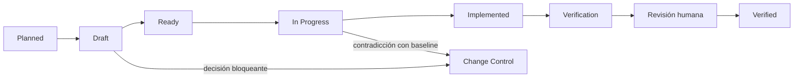
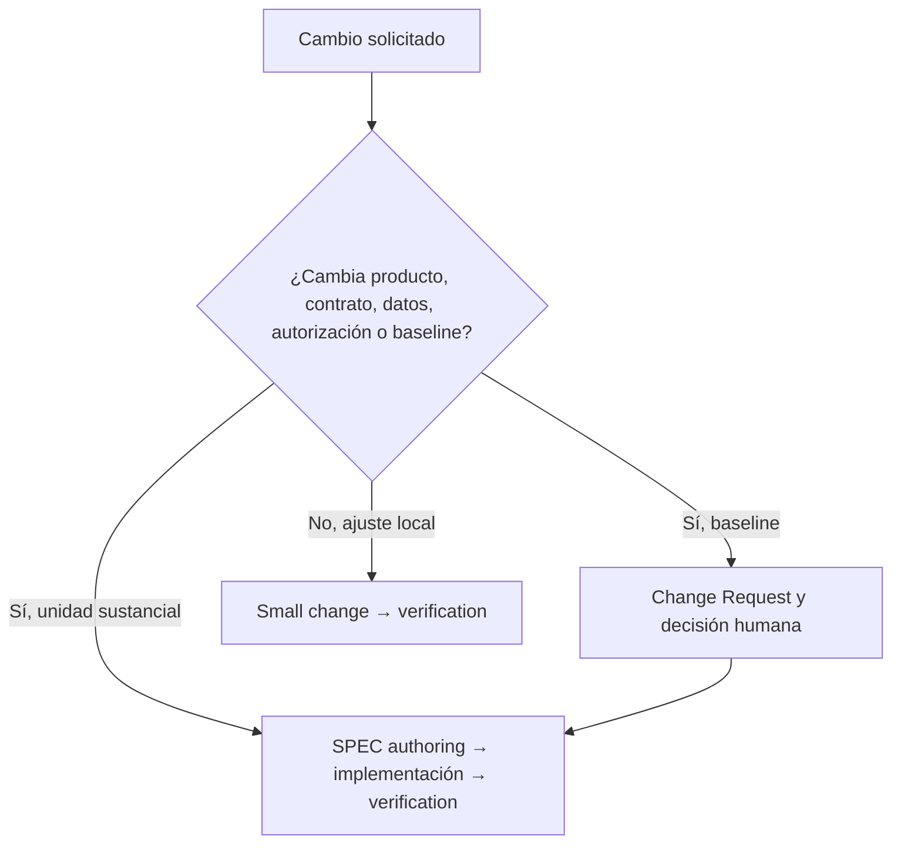

# Formación 0 — Cómo trabajamos en Synqo

## Objetivo

Antes de implementar una funcionalidad, entender cómo Synqo convierte una necesidad en un cambio verificable. El proyecto combina una planificación macro secuencial con unidades pequeñas Spec-First. La referencia normativa es [IMPLEMENTATION-GUIDE.md](../../IMPLEMENTATION-GUIDE.md) y el detalle del ciclo está en [spec-driven-development.md](../../development/spec-driven-development.md).

## Las fuentes y su función

| Fuente | Para qué sirve |
|---|---|
| Requisitos, historias y UX | Explican qué problema se resuelve y qué experiencia se espera. |
| ADR, diseño técnico y baseline | Fijan límites de arquitectura, seguridad, datos y testing. |
| SPEC | Acota una unidad implementable y define aceptación y pruebas. |
| Código, migraciones y tests | Materializan y demuestran el comportamiento. |
| Registro de SPECs, estado y evidencia TFM | Conservan trazabilidad sin duplicar la historia de Git. |

## El ciclo SDD

Una SPEC no pasa a `Ready` si obliga a inventar una decisión. Tampoco se marca `Verified` solo porque compile: necesita comprobaciones automatizadas proporcionales, revisión humana y documentación sincronizada.

## Baseline Conformance Preflight

Antes de pasar una SPEC `Ready` a `In Progress`, se comprueba que sus cimientos existen de verdad en el workspace: decisiones arquitectónicas, SPECs de las que depende, datos y contratos, controles server-side y toolchain. Un estado documental `Verified` no sustituye esa comprobación.

El resultado es explícitamente `Pass` o `Fail` y queda enlazado en la SPEC o en el estado de implementación. Un `Fail` bloquea la nueva slice: se corrige primero el cimiento; no se convierte en deuda para una SPEC posterior. La Verification final repite la comprobación para impedir un cierre basado en evidencia solo documental.

## Elegir el flujo adecuado

El objetivo no es producir documentación por inercia. Es evitar que un cambio relevante se implemente sin alcance, criterio de aceptación o evidencia.

## Decisiones abiertas: `OPEN-*`

Un identificador `OPEN-*` nombra una decisión pendiente que importa para el diseño o la implementación y que todavía no debe resolverse por intuición. No es un ticket, una tarea técnica ni una lista de ideas: deja visible **qué decisión falta**, qué impacto tiene y quién debe aceptarla.

Úsalo cuando haya alternativas razonables y elegir una cambie requisito, experiencia, seguridad, datos, autorización o arquitectura. Cada entrada debe incluir la pregunta concreta, opciones o límites conocidos, fuentes afectadas, si bloquea una SPEC y el siguiente paso para cerrarla. Si afecta la baseline, se deriva a Change Control; si bloquea la SPEC, esta permanece `Draft`.

Cuando el propietario decide, se propaga el resultado a las fuentes normativas afectadas y el `OPEN-*` pasa a cerrado o se retira del listado vivo. No se deja una decisión significativa resuelta únicamente en el chat o en un comentario de código.

En Synqo, `OPEN-01` a `OPEN-09` son ejemplos históricos ya cerrados: su resolución está en [open-decisions-resolution.md](../../planning/01-open-decisions/open-decisions-resolution.md) y el resumen vigente en [19-open-questions.md](../../product/19-open-questions.md). No deben reutilizarse ni reabrirse sin una nueva decisión justificada.

## Trabajo diario y Git

1. Comprobar rama y estado del workspace antes de editar.
2. Completar el Baseline Conformance Preflight antes de iniciar una SPEC.
3. Trabajar en una rama corta derivada de `main`; el propietario autoriza crear o cambiar de rama.
4. Mantener commits coherentes y en español con Conventional Commits.
5. Abrir un PR contra `main`, revisar diff y esperar CI verde.
6. Preferir squash merge y conservar en documentación solo la evidencia útil, no logs completos.

## Preguntas de clase

1. ¿Qué diferencia hay entre una SPEC y un ADR?

Una SPEC describe una unidad concreta que se va a construir y verificar: alcance, aceptación, pruebas y límites. Un ADR registra una decisión arquitectónica duradera y su razonamiento; varias SPEC pueden respetar el mismo ADR.

2. ¿Por qué una prueba E2E no sustituye la autorización del servidor?

Un E2E comprueba un recorrido concreto de interfaz, pero no prueba todas las peticiones que un atacante o cliente puede fabricar. La API debe comprobar permisos, pertenencia al equipo, estado y controles de seguridad en cada endpoint.

3. ¿Cuándo una decisión técnica deja de ser local y requiere Change Control?

Requiere Change Control cuando deja de ser un detalle local y modifica una decisión estable: requisito, dominio, lifecycle, privacidad, autorización, seguridad, contrato público, datos relevantes o arquitectura baseline. Elegir un nombre de helper o reordenar una función no lo requiere.

4. ¿Qué información debe quedar en Git y cuál en el registro de evidencia?

Git conserva el cambio exacto, sus commits, revisiones y diffs. El registro de evidencia aporta contexto verificable: por qué el cambio importa, qué artefactos lo prueban y qué resultado objetivo se obtuvo. No debe copiar el historial ni logs completos.

