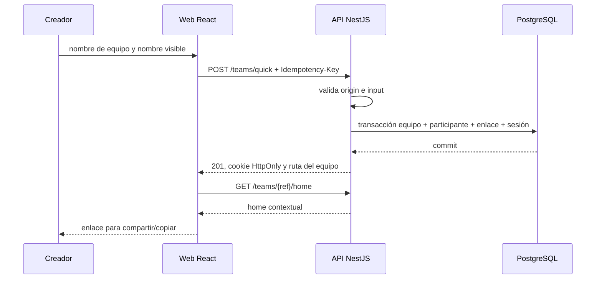

# SPEC-002 — Equipo rápido y acceso de participante

> Fuente normativa: [SPEC-002](../../specs/SPEC-002-quick-team-participant-access.md). Esta guía explica la primera slice de producto sin duplicar sus requisitos ni contratos.

## Qué aprende la persona

- Crear una unidad transaccional en PostgreSQL desde una API NestJS.
- Modelar acceso temporal mediante una cookie HttpOnly y sesión contextual.
- Aplicar CSRF/origin, idempotencia, rate limiting y `ProblemDetails` a rutas públicas.
- Recorrer un flujo React de crear, compartir y unirse desde dos contextos de navegador.

## Antes de empezar

Parte del entorno de SPEC-001 y usa las mismas versiones. Para ejecutar solo las comprobaciones relevantes:

```bash
pnpm db:up
pnpm db:migrate
pnpm --filter @synqo/api test:integration
pnpm test:e2e
```

La web detecta `Intl.DateTimeFormat().resolvedOptions().timeZone`; si el navegador no aporta valor, usa `Europe/Madrid`. Es un fallback de UX, no una zona editable todavía.

## Mapa de artefactos

| Archivo | Responsabilidad |
|---|---|
| [Migration20260925000000.ts](../../../apps/api/src/migrations/Migration20260925000000.ts) | Tablas de equipos, participantes, sesiones y credenciales públicas. |
| [teams.service.ts](../../../apps/api/src/teams.service.ts) | Transacción de creación, unión y resolución de sesión contextual. |
| [teams.controller.ts](../../../apps/api/src/teams.controller.ts) | Rutas REST, cookies de sesión y CSRF. |
| [request-protection.service.ts](../../../apps/api/src/request-protection.service.ts) | Origin, CSRF e idempotencia. |
| [problem-details.filter.ts](../../../apps/api/src/problem-details.filter.ts) | Errores seguros y uniformes. |
| [App.tsx](../../../apps/web/src/App.tsx) | Crear equipo, unirse, home y compartir enlace. |
| [teams.integration-spec.ts](../../../apps/api/test/teams.integration-spec.ts) | Integración con PostgreSQL y controles de seguridad. |
| [app-shell.spec.ts](../../../apps/web/tests/app-shell.spec.ts) | E2E con creador y segundo contexto. |

## Secuencia principal



## Recorrido guiado

La creación no inserta filas independientes sin coordinación. `TeamsService.createQuick` abre una transacción y persiste equipo, participante inicial, credencial pública y hash de sesión antes de hacer `commit`; cualquier excepción ejecuta `rollback`.

La cookie `synqo_context_session` es `HttpOnly`, de modo que el código de la web no lee el token de sesión. El token se guarda hasheado. El token CSRF separado se puede leer para enviarlo en mutaciones que ya llevan cookie; `RequestProtectionService` compara el valor y también rechaza un `Origin` no permitido.

Una `Idempotency-Key` repetida con el mismo payload devuelve el mismo resultado; con un payload distinto responde conflicto. El `ThrottlerGuard` limita abuso de rutas públicas. El filtro de errores entrega `application/problem+json`, evitando respuestas de desarrollo con detalles internos.

El home primero intenta obtener el contexto autenticado. Solo si no hay sesión válida recupera el resumen público y pide un nombre para crear una identidad local distinta; por eso dos personas pueden compartir nombre visible sin apropiarse de la otra.

## Bloques de código para explicar en clase

Los siguientes fragmentos son deliberadamente pequeños. Sirven para leer una decisión concreta y después saltar al archivo enlazado para ver su contexto completo.

### Cliente: cabeceras de una mutación

De [App.tsx](../../../apps/web/src/App.tsx):

```ts
const mutationHeaders = () => ({
  'content-type': 'application/json',
  'idempotency-key': crypto.randomUUID(),
  ...(csrfToken() ? { 'x-csrf-token': csrfToken()! } : {}),
});
```

La interfaz identifica JSON, genera una clave para distinguir reintentos y añade el token CSRF solo si existe. No intenta leer `synqo_context_session`: esa cookie es `HttpOnly` y el navegador la adjunta automáticamente cuando corresponde.

### Cliente: contexto antes que resumen público

También en [App.tsx](../../../apps/web/src/App.tsx):

```ts
fetch(`${api}/teams/${teamRef}/home`).then(async (response) => {
  if (response.ok) return setHome((await response.json()) as Home);
  const publicTeam = await fetch(`${api}/teams/${teamRef}`);
  if (publicTeam.ok) return setTeam((await publicTeam.json()) as Team);
  return setError('El enlace no es válido o ya no está disponible.');
});
```

Este orden separa dos capacidades: una sesión válida ve su home; alguien con solo el enlace obtiene el contexto mínimo para identificarse. No se deduce la identidad de un participante a partir del `teamRef` o del nombre visible.

### API: la transacción protege el agregado inicial

Versión abreviada de [teams.service.ts](../../../apps/api/src/teams.service.ts):

```ts
try {
  await client.query('begin');
  // equipo + participante + enlace público + sesión hasheada
  await client.query('commit');
} catch (error) {
  await client.query('rollback');
  throw error;
} finally {
  client.release();
}
```

La lección es la propiedad atómica: no queremos un equipo sin creador ni una sesión cuyo participante no exista. La consulta SQL concreta está en el archivo fuente; el fragmento muestra el límite transaccional, no pretende reemplazarlo.

### API: CSRF solo cuando hay contexto de cookie

De [request-protection.service.ts](../../../apps/api/src/request-protection.service.ts):

```ts
const context = cookies.match(/(?:^|; )synqo_context_session=([^;]+)/)?.[1];
if (!context) return;
const csrf = cookies.match(/(?:^|; )synqo_csrf=([^;]+)/)?.[1];
if (!csrf || supplied !== csrf) {
  throw new ForbiddenException({ code: 'CSRF_INVALID' });
}
```

Una creación pública sin sesión contextual todavía no presenta riesgo de CSRF por cookie. En cambio, si la petición trae una sesión, exige el token doble y antes valida el `Origin` permitido. Es una defensa en servidor: no depende de que la interfaz se comporte correctamente.

## Verificación

| Comprobación | Qué demuestra |
|---|---|
| `pnpm --filter @synqo/api test:integration` | Transacción, aislamiento entre equipos, nombre no único, CSRF/origin, idempotencia, rate limit y errores. |
| `pnpm test:e2e` | Crear, compartir y unirse desde dos contextos de navegador. |
| `pnpm db:migrate` | La migración es aplicable contra PostgreSQL de desarrollo. |
| CI `browser-smoke` | El E2E levanta API y PostgreSQL; no depende de procesos locales. |

## Límites y siguiente paso

No hay cuenta global, edición de zona horaria, disponibilidad, decisiones, lifecycle ni notificaciones. Esos comportamientos pertenecen a SPEC-003 y posteriores. La zona queda detectada silenciosamente; habilitar su edición requerirá una unidad que considere histórico y reglas temporales.

## Ejercicios

<details>
<summary>1. Explica por qué un enlace público no basta para leer el home contextual de otra persona.</summary>

Guía: el enlace identifica un recurso compartible y permite leer el resumen mínimo. El home requiere `synqo_context_session`, cuya sesión está ligada en servidor a un participante y al equipo solicitado. Esto evita que conocer una URL conceda la identidad o datos contextuales de otra persona.
</details>

<details>
<summary>2. Simula un doble clic de creación: ¿qué control UX y qué control de servidor deben cooperar?</summary>

Guía: la interfaz debe deshabilitar el envío mientras espera la respuesta para evitar acciones accidentales. El servidor debe mantener idempotencia para reintentos de red usando la misma clave. En la implementación actual la API cubre la idempotencia, pero el formulario todavía no mantiene un estado de envío que deshabilite el botón; es una mejora pendiente que conviene detectar durante la revisión de clase.
</details>

<details>
<summary>3. Compara el token de sesión con el token CSRF: ¿por qué uno es HttpOnly y el otro no?</summary>

Guía: la sesión acredita quién actúa, así que JavaScript no debe poder leerla; el navegador la envía como cookie `HttpOnly`. El token CSRF no acredita identidad por sí solo: JavaScript lo lee para demostrar que la petición nació desde la aplicación junto con la cookie contextual. Ambos usan `SameSite=Lax` y se validan en servidor.
</details>

<details>
<summary>4. Sigue en el test de integración el caso de una sesión del equipo A que intenta abrir el home del B.</summary>

Guía: en [teams.integration-spec.ts](../../../apps/api/test/teams.integration-spec.ts) se crean dos equipos, se envía la cookie del primero al home del segundo y se espera `403`. Después, [teams.service.ts](../../../apps/api/src/teams.service.ts) busca simultáneamente el hash de sesión y `teamRef`; no basta con que la sesión exista, debe pertenecer al mismo equipo.
</details>
